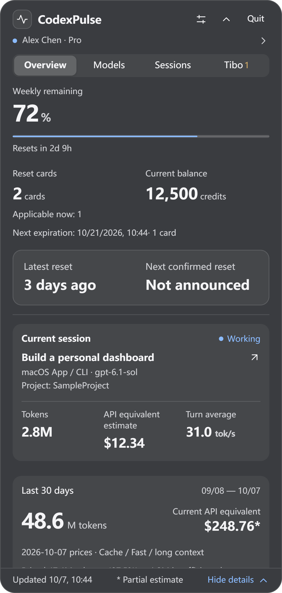
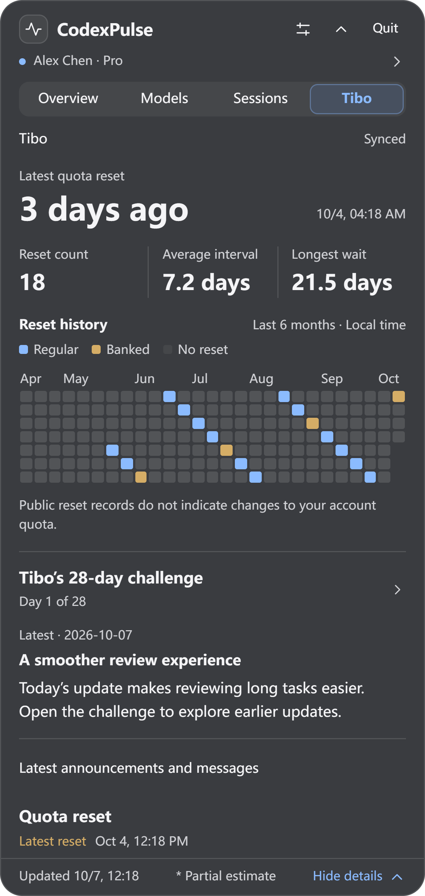

# CodexPulse

[中文](README.md) · **English**

Track Codex account limits, work status, token usage, and reset updates on your desktop. Supports Codex App / CLI on Windows / WSL and macOS.

**[Download the latest release](https://github.com/lvzixun/CodexPulse/releases/latest)** · [Usage and development](docs/guide.en.md)

## Features

- **Limits:** remaining quota, reset times, credits, and reset cards.
- **Usage:** 30-day totals, model share charts, and API-equivalent cost estimates.
- **Sessions:** running work first; expand for model, usage, and average speed.
- **Tibo:** reset announcements, history, and the 28-day challenge, with on-demand translation.

## Preview

Windows offers a tray icon and a one-line floating window. The macOS menu bar shows work status, model, and speed, with `↻` for new reset messages. Click to expand details.

New updates download automatically and are signature-verified. Click “Restart and update” to install without opening a browser.

Sample data; click for full-resolution images. More screenshots: [Models](docs/screenshots/models-en.png) · [Sessions](docs/screenshots/sessions-en.png).

## Install

- **Windows 10 / 11 x64:** install `x64-setup.exe`. The installer can install WebView2 when needed.
- **macOS 12+:** download the universal `.dmg` and drag into Applications. Supports Apple Silicon / Intel.

The Windows installer is unsigned; macOS is ad-hoc signed without notarization.

The usage ledger stays on-device; conversation bodies are not stored. API-equivalent estimates are **not subscription charges**.

[Usage, refresh, and development](docs/guide.en.md) · [Product design](docs/design/codexpulse-v1.md) · [Development status](docs/development/status.md)
