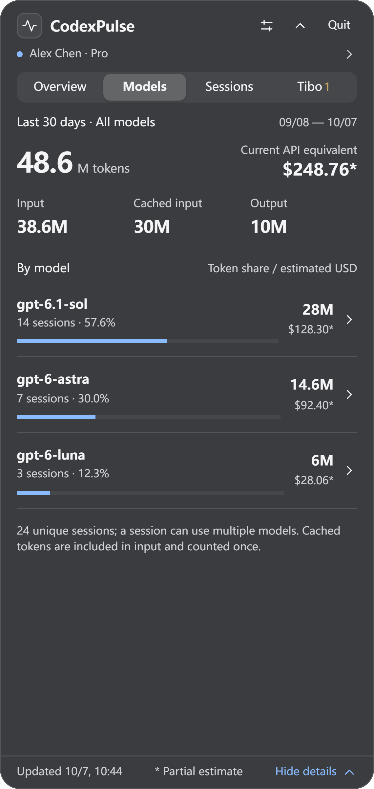
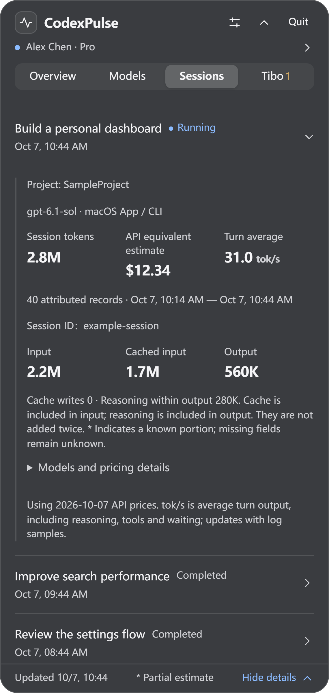

# CodexPulse

[中文](README.md) · **English**

Keep Codex **account limits, work status, token usage, and reset updates** on your desktop.

Windows offers a tray icon and a compact floating window; macOS uses a menu bar panel. Track local usage from Codex App / CLI, including WSL sources on Windows.

**[Download the latest release](https://github.com/lvzixun/CodexPulse/releases/latest)** · [Interface and features](#interface-and-features) · [Data and metrics](#data-and-metrics) · [Development status](docs/development/status.md)

## Install and open

| Platform                              | Download                       | Getting started                                                                        |
| ------------------------------------- | ------------------------------ | -------------------------------------------------------------------------------------- |
| **Windows 10 / 11 · x64**             | `x64-setup.exe` from Releases  | Install and launch from Start. Click the tray icon or floating window to open details. |
| **macOS 12+ · Apple Silicon / Intel** | Universal `.dmg` from Releases | Drag into Applications, launch, and click the menu bar icon.                           |

Windows requires WebView2 Runtime; the installer can install it when needed. Login startup is off by default and can be enabled in Settings.

The Windows installer has no Authenticode signature. The macOS package is ad-hoc signed without Developer ID signing or notarization.

## Everyday use

The **Windows floating window** fits into one line: work status, current model, and average speed. A highlighted “Reset” marker appears for new important reset messages. Click to expand details; drag its left side to reposition it.

<a href="docs/screenshots/compact-en.png"></a>

Disable the floating window in Settings if desired. Left-click the tray icon to open the same detail panel; right-click for Settings, Quit, and other simple actions.

On **macOS**, click the menu bar icon to open details. Both platforms share the features below.

## Interface and features

Screenshots show fictional accounts and sample data in the actual frontend's development preview, using the menu bar detail layout. Native fonts and material effects vary by platform, system theme, and desktop background. Images are exported as **3× PNGs**; click to view the originals.

### Overview: limits and current work at a glance

Check remaining limits, account refresh times, credits, and reset cards, with public reset information near the top. The current session shows its model, tokens, API-equivalent cost, and average speed. Scroll down for local 30-day usage and account lifetime totals.

<a href="docs/screenshots/overview-en.png"></a>

### Models: totals and a breakdown by model

Compare model usage shares, token composition, and API-equivalent costs over the last 30 days. Click a model for its breakdown and a link to related sessions.

<a href="docs/screenshots/models-en.png"></a>

### Sessions: running work comes first

A simple list labels each session's status. Expand a row to inspect usage, cost, speed, project, and model details.

<a href="docs/screenshots/sessions-en.png"></a>

### Tibo: reset updates and the 28-day challenge

Follow the latest public reset, active watches and countdowns, six months of reset history, and Tibo's 28-day challenge with daily entries. Translate messages on demand. Public announcements do not confirm a quota change for your account.

<a href="docs/screenshots/tibo-en.png"></a>

## Settings and refresh

- **Appearance:** dark, light, or system theme. Blue is the default accent; violet, teal, amber, and rose are also available.
- **Independent refresh:** configure automatic or manual refresh and intervals separately for account limits and Codex Resets messages, or refresh immediately. Manual mode shows cached data at startup and makes no background requests for that group. Translation runs only when clicked.
- **On-demand collection:** on Windows, automatic account requests require expanded, visible details; the compact window makes no account requests. macOS runs once at startup, then on schedule while the panel is visible. Reopening refreshes only when the cache is due. Local log collection and public message refresh run independently.

## Data and metrics

- **Scope:** local statistics cover readable Codex logs; account lifetime totals come from the server and are labeled separately. Subagents are excluded from session lists and counts; their tokens and costs remain in total usage.
- **Cost and speed:** API-equivalent costs are reference-price estimates with explicit coverage, **not subscription charges**. `tok/s` is a sampled turn average including reasoning, tools, and waiting. Unavailable values display `—`.
- **Local data:** the usage ledger stays on-device; conversation bodies are not stored. Profile data stays in memory. Requests use file-based Codex credentials, never overwrite `auth.json`, and exclude credentials from the database and diagnostics.

## Development

<details>
<summary>Requirements, running locally, and building</summary>

Requires Rust stable ≥ 1.90, Node.js 24+, and pnpm 11. Release checks use Rust 1.97.1. Windows needs Visual Studio C++ tools and WebView2; macOS needs Xcode Command Line Tools.

```sh
pnpm install --frozen-lockfile
pnpm dev
```

Check and build:

```sh
pnpm check
node --test apps/desktop/test/*.test.ts
cargo test --workspace
cargo clippy --workspace --all-targets -- -D warnings
pnpm build
```

Universal macOS package:

```sh
rustup target add aarch64-apple-darwin x86_64-apple-darwin
pnpm build --target universal-apple-darwin
```

Cargo and target libraries must use the same Rust toolchain. Artifacts are generated under `target/universal-apple-darwin/release/bundle`.

See [screenshot notes](docs/screenshots/README.md) for capture instructions.

</details>

## Development documentation

Implementation documents are currently in Chinese:

- [Product and technical design](docs/design/codexpulse-v1.md) · [Implementation status](docs/development/status.md)
- [Windows parity and cross-platform release](docs/development/windows-release-0.1.6.md) · [macOS validation](docs/development/macos-2026-10-06.md)
- [Development handoff](docs/development/handoff-2026-10-06.md) · [Reference prices and coverage](resources/pricing/README.md)
