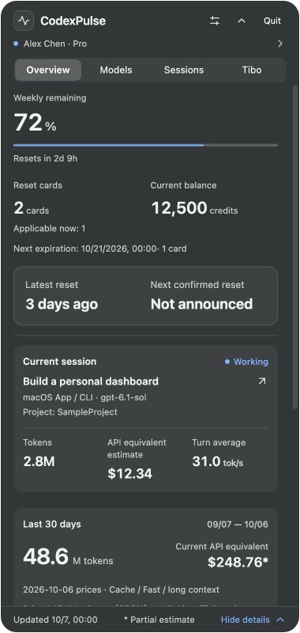
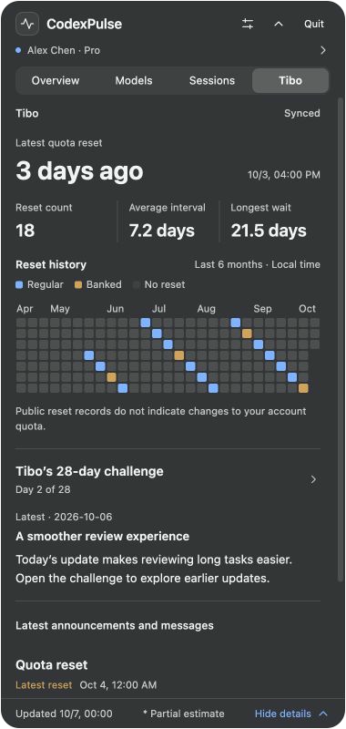
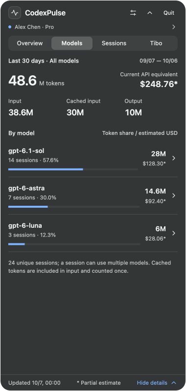

# CodexPulse

[中文](README.md) · **English**

A desktop status panel for Codex. Track account limits, session usage, and public reset updates.

[Download the macOS preview](https://github.com/lvzixun/CodexPulse/releases) · [Development status](docs/development/status.md)

## Features

- **Overview:** limits and reset times, reset cards and credits, the current work session, and a combined section for local 30-day usage and account lifetime totals.
- **Models / Sessions:** model usage shares, paginated session history, inline details, and API-equivalent pricing coverage.
- **Tibo:** the latest public reset, six months of reset history, and expandable daily entries from the 28-day challenge.

Dark appearance is the default; change it in Settings. macOS uses a menu bar icon and a native material panel. Windows supports a tray icon and an optional compact floating window. Current releases provide macOS packages only.

## Preview

Screenshots use fictional accounts and example data. Native material appearance varies with the system theme and desktop background.



<details>
<summary>Tibo and Models</summary>





</details>

## Install

1. Download the universal DMG from [Releases](https://github.com/lvzixun/CodexPulse/releases).
2. Open it and drag CodexPulse into Applications.
3. Launch the app and click the menu bar icon.

The package includes Apple Silicon and Intel binaries with a macOS 12 deployment target. Native checks for this release ran on Apple Silicon.

This is an **ad-hoc signed preview without Developer ID signing or notarization**. macOS may require first-launch approval in Privacy & Security. Launch manually; login startup acceptance remains pending.

## Data and metrics

Local usage covers readable Codex logs; account lifetime totals come from the server and carry a separate scope label. The usage ledger stays on-device, and profile data stays in memory. File-based Codex credentials are used for authenticated requests, excluded from the database and diagnostics, and never overwritten by CodexPulse. Conversation bodies are not stored.

API-equivalent costs are reference-price estimates with explicit coverage, **not subscription charges**. `tok/s` is a sampled turn average including reasoning, tools, and waiting. Unavailable values display `—`.

## Development

Requires Rust stable ≥ 1.90, Node.js 24+, and pnpm 11. macOS needs Xcode Command Line Tools. Windows needs Visual Studio C++ tools and WebView2.

```sh
pnpm install --frozen-lockfile
pnpm dev
```

Check and build:

```sh
pnpm check
node --test apps/desktop/test/*.test.ts
cargo test --workspace
cargo clippy --workspace --all-targets -- -D warnings
pnpm build
```

Universal macOS package:

```sh
rustup target add aarch64-apple-darwin x86_64-apple-darwin
pnpm build --target universal-apple-darwin
```

Cargo and target libraries must use the same Rust toolchain. Artifacts are generated under `target/universal-apple-darwin/release/bundle`.

## Documentation

Implementation documents are currently in Chinese:

- [Product and technical design](docs/design/codexpulse-v1.md)
- [Implementation status and pending acceptance](docs/development/status.md)
- [Development handoff](docs/development/handoff-2026-10-06.md)
- [macOS validation](docs/development/macos-2026-10-06.md)
- [Reference prices and coverage](resources/pricing/README.md)
