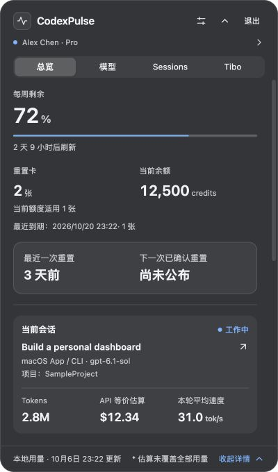
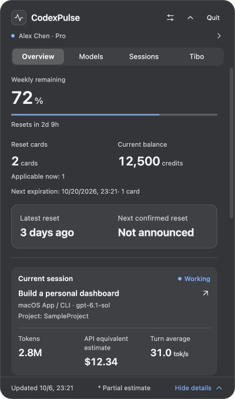
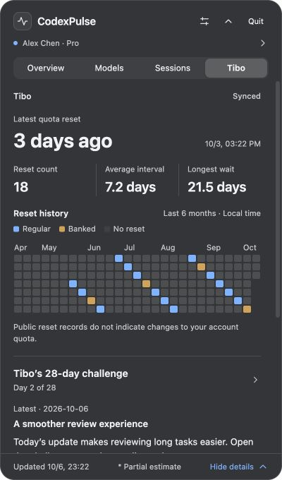
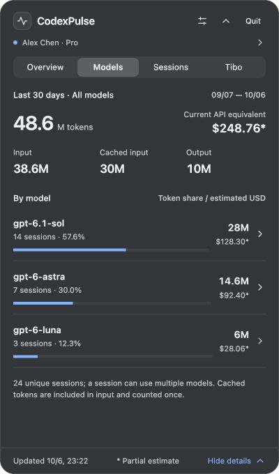

# CodexPulse

[中文](#中文) · [English](#english) · [Releases](https://github.com/lvzixun/CodexPulse/releases)

Codex 的桌面状态伴侣 / A desktop companion for Codex usage and account status.

## 中文

CodexPulse 将账户额度、当前工作会话、本机用量和 Tibo 的公开重置动态放在一个面板中。macOS 使用菜单栏图标和原生材质面板；Windows 提供托盘和可选小浮窗。

### 功能

- **总览**：账户姓名与级别、额度剩余和刷新倒计时、重置卡及最近到期时间、credits 余额、最近一次重置、当前会话及速度。最近 30 天本机统计和账户累计放在总览底部同一区域，分别标明范围。
- **模型和 Sessions**：模型用量占比、历史分页、行内展开的会话详情及计价依据；会话名称来自 Codex 标题索引。
- **Tibo**：最近重置、次数和间隔、近半年重置历史、28 天挑战最新详情。展开挑战后查看每日内容，无第二层分类 tab。
- **设置**：独立的额度 / 公开动态刷新周期、额外来源、名称隐藏、强调色和诊断信息。面板顶部可直接退出。
- **语言**：自动跟随系统首选显示语言。`zh` 及其地区变体使用简体中文，英文与其他未支持语言使用英文。日期和数量随界面语言格式化；账户名字、会话标题及来源正文保留原文。无需手动配置语言。

### 截图

以下为 400 × 680 面板的前端预览，使用虚构账户与示例数据，不包含真实个人资料。原生毛玻璃随 macOS 主题和桌面背景变化。

| 总览（中文）                                  | Overview (English)                                    |
| --------------------------------------------- | ----------------------------------------------------- |
|  |  |

| Tibo                                                              | Models                                         |
| ----------------------------------------------------------------- | ---------------------------------------------- |
|  |  |

### 下载与使用

从 [Releases](https://github.com/lvzixun/CodexPulse/releases) 下载 macOS 通用 DMG，打开后将 CodexPulse 拖到 Applications，启动并点击菜单栏图标查看面板。通用版包含 Apple Silicon 和 Intel 架构，最低目标 macOS 12；本轮原生验证在 Apple Silicon 完成。

**v0.1.0 是 macOS 预览版，采用 ad-hoc 签名，尚未进行 Developer ID 签名或公证。** 下载后系统可能阻止首次打开；确认来源后，可通过系统设置的“隐私与安全性”处理。当前登录启动服务尚未验收，请手动启动。本次不发布未经 Windows 原生验证的新安装包。

默认读取本机 Codex home 的日志和文件型登录凭据。额度和账户统计通过 HTTPS 获取，公开动态来自 Codex Resets；凭据只用于对应认证请求，不写入产品数据库或诊断输出。个人资料只在内存保留；用量账本保存在本机。程序不自动续期或改写 `auth.json`，不保存对话正文。

**统计口径**：本机最近 30 天用量只覆盖可读取的日志，与服务端账户累计分别展示。API 等价金额使用内置参考价重算，区分缓存等情况并标明未覆盖用量；它不是订阅账单。`tok/s` 是有有效样本时的本轮或上轮平均输出速度，包含推理、工具和等待时间。缺少数据时显示 `—`。

## English

CodexPulse brings account limits, the current work session, local usage, and Tibo's public reset updates into one panel. macOS uses a menu bar icon and a native material panel; Windows supports a tray icon and an optional compact floating window.

### Features

- **Overview:** account name and plan, remaining limits and reset countdowns, reset cards with the next expiry, credits, the latest reset, and current session metrics. Local 30-day usage and account lifetime statistics share the bottom section with distinct scope labels.
- **Models and Sessions:** model usage shares, paginated history, inline session details, and pricing coverage. Session names come from Codex's local title index.
- **Tibo:** the latest reset, reset intervals, six months of reset history, and the latest 28-day challenge update. Expand the challenge to see daily entries.
- **Settings:** independent quota and public-feed refresh schedules, extra sources, title privacy controls, accent colors, and diagnostics. Quit directly from the panel header.
- **Localization:** follows the first preferred OS display language. Chinese variants use Simplified Chinese; English and all unsupported languages use English. Dates and numbers follow the UI language. Account names, session titles, and source content retain their original text.

The screenshots above use **fictional example data** in a frontend preview. Native glass appearance depends on the macOS theme and desktop background.

### Install and data handling

Download the universal macOS DMG from [Releases](https://github.com/lvzixun/CodexPulse/releases), drag CodexPulse into Applications, then launch it and click the menu bar icon. The package includes Apple Silicon and Intel binaries with a macOS 12 deployment target; native checks for this release ran on Apple Silicon.

**v0.1.0 is an ad-hoc signed macOS preview, without Developer ID signing or notarization.** macOS may require approval in Privacy & Security after you verify the download source. Launch manually; login startup has not passed native acceptance. No new Windows installer is published without native Windows validation.

Local logs feed an on-device usage ledger. File-based Codex credentials are used only for authenticated HTTPS requests; credentials are excluded from the database and diagnostics. Account profile data stays in memory. CodexPulse does not refresh or overwrite `auth.json`, and does not store conversation bodies.

Local 30-day usage covers readable logs and is separate from server account totals. **API-equivalent cost is a reference-price estimate, not a subscription bill**, and marks missing coverage. `tok/s` measures a sampled turn average including reasoning, tool work, and waiting; unavailable values display `—`.

## Development / 开发

Requirements: Rust stable ≥ 1.90, Node.js 24+, pnpm 11. macOS needs Xcode Command Line Tools. Windows builds need Visual Studio C++ tools and WebView2.

```sh
pnpm install --frozen-lockfile
pnpm dev
```

Checks and build:

```sh
pnpm check
node --test apps/desktop/test/*.test.ts
cargo fmt --all -- --check
cargo test --workspace
cargo clippy --workspace --all-targets -- -D warnings
pnpm build
```

Universal macOS build (install both targets into the toolchain actually used by Cargo):

```sh
rustup target add aarch64-apple-darwin x86_64-apple-darwin
pnpm build --target universal-apple-darwin
```

Artifacts are generated under `target/universal-apple-darwin/release/bundle/{macos,dmg}`. Host builds use `target/release/bundle`. If Homebrew Rust and rustup coexist, ensure Cargo and target libraries use the same toolchain.

`pnpm dev` starts the desktop application. A standalone browser normally shows a disconnected state. For screenshot work only, run `pnpm --filter @codexpulse/desktop dev` and visit `http://127.0.0.1:1420/?preview=readme&language=en` (or `zh-CN`). Example fixtures and the language override are development-only and excluded from production assets.

UI strings use reactive translation helpers in `apps/desktop/src/lib/i18n.ts` and the English catalog in `locales/en.json`; Chinese source strings are message IDs. Native language detection and menu labels live in `src-tauri/src/language.rs`. Keep interpolation parameters identical and run the catalog tests when adding translations.

## Documentation / 文档

- [产品、UI 与技术设计 / Product and technical design](docs/design/codexpulse-v1.md)
- [设计索引 / Design index](docs/design/README.md)
- [实际状态与待验证项目 / Implementation status](docs/development/status.md)
- [i18n 与 macOS 发布记录 / Localization and release report](docs/development/i18n-release-2026-10-06.md)
- [macOS 实现与验证 / macOS implementation](docs/development/macos-2026-10-06.md)
- [开发交接 / Development handoff](docs/development/handoff-2026-10-06.md)

The performance figures in the design are acceptance targets. Full hardware, accessibility, long-run resource, and pricing coverage acceptance remain tracked in the status document.

## Repository / 仓库

- `apps/desktop`: Svelte / TypeScript UI and Tauri platform integration.
- `crates/pulse-core`: incremental parsing, SQLite ledger, summaries, and pricing.
- `resources/pricing`: versioned reference prices and coverage notes.
- `docs`: design, validation reports, and screenshots.
- `scripts`: local development and measurement tools.
- `work`, `target`, `releases`: ignored local experiments, build caches, and retained release artifacts.
