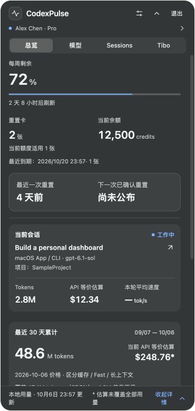
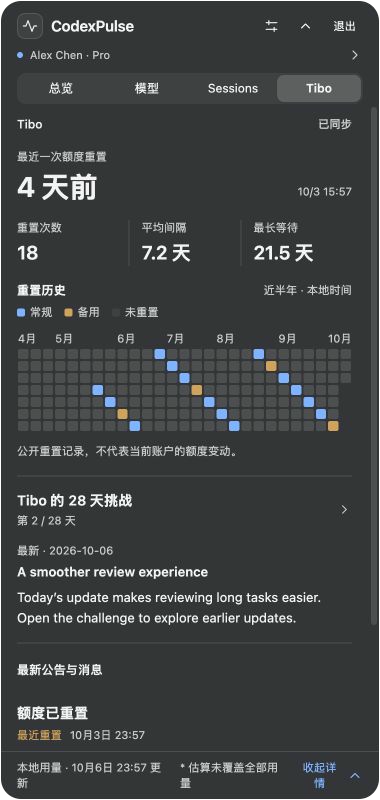
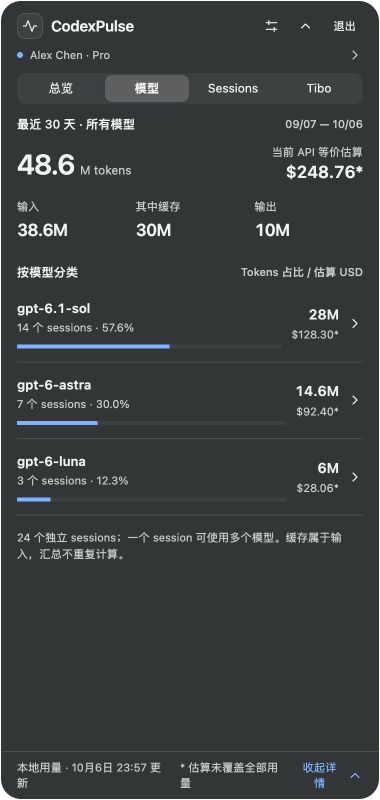

# CodexPulse

**中文** · [English](README.en.md)

Codex 的桌面状态面板。查看账户额度、会话用量和公开重置动态。

[下载 macOS 预览版](https://github.com/lvzixun/CodexPulse/releases) · [开发状态](docs/development/status.md)

## 功能

- **总览**：额度与重置时间、重置卡和 credits、当前工作会话；底部集中展示本机最近 30 天用量与账户累计。
- **模型 / Sessions**：模型用量占比、会话历史与行内详情、API 等价费用及计价覆盖。
- **Tibo**：最新公开重置、近半年重置历史和 28 天挑战；展开查看每日内容。

macOS 使用菜单栏图标与原生材质面板。Windows 提供系统托盘和可选小浮窗，当前 Release 仅提供 macOS 安装包。

## 界面预览

使用虚构账户和示例数据。原生材质会随系统主题和桌面背景变化。



<details>
<summary>Tibo 与模型页面</summary>





</details>

## 安装

1. 从 [Releases](https://github.com/lvzixun/CodexPulse/releases) 下载通用 DMG。
2. 打开 DMG，将 CodexPulse 拖到 Applications。
3. 启动应用，点击菜单栏图标打开面板。

通用包包含 Apple Silicon 和 Intel 架构，最低部署目标为 macOS 12。本轮实机验证在 Apple Silicon 完成。

当前为 **ad-hoc 签名预览版，尚未进行 Developer ID 签名和公证**。首次打开可能需要在系统“隐私与安全性”中允许。登录启动尚未完成验收，请手动启动。

## 数据与统计口径

本机用量来自可读取的 Codex 日志，账户累计来自服务端，两者分别标明范围。用量账本保存在本机，个人资料仅在内存中保留。认证请求使用 Codex 的文件型凭据；程序不改写 `auth.json`，凭据不进入数据库或诊断输出，也不保存对话正文。

API 等价费用是参考价估算，标明未覆盖用量，**不是订阅账单**。`tok/s` 是有日志样本时的轮次平均输出速度，包含推理、工具和等待时间。缺少数据时显示 `—`。

## 开发

需要 Rust stable ≥ 1.90、Node.js 24+ 和 pnpm 11。macOS 需要 Xcode Command Line Tools；Windows 需要 Visual Studio C++ 工具与 WebView2。

```sh
pnpm install --frozen-lockfile
pnpm dev
```

检查与构建：

```sh
pnpm check
node --test apps/desktop/test/*.test.ts
cargo test --workspace
cargo clippy --workspace --all-targets -- -D warnings
pnpm build
```

macOS 通用包：

```sh
rustup target add aarch64-apple-darwin x86_64-apple-darwin
pnpm build --target universal-apple-darwin
```

Cargo 和 target 标准库须使用同一 Rust 工具链。通用包位于 `target/universal-apple-darwin/release/bundle`。

## 文档

- [产品与技术设计](docs/design/codexpulse-v1.md)
- [实施状态与待验证项目](docs/development/status.md)
- [开发交接](docs/development/handoff-2026-10-06.md)
- [macOS 验证记录](docs/development/macos-2026-10-06.md)
- [参考价与覆盖说明](resources/pricing/README.md)
