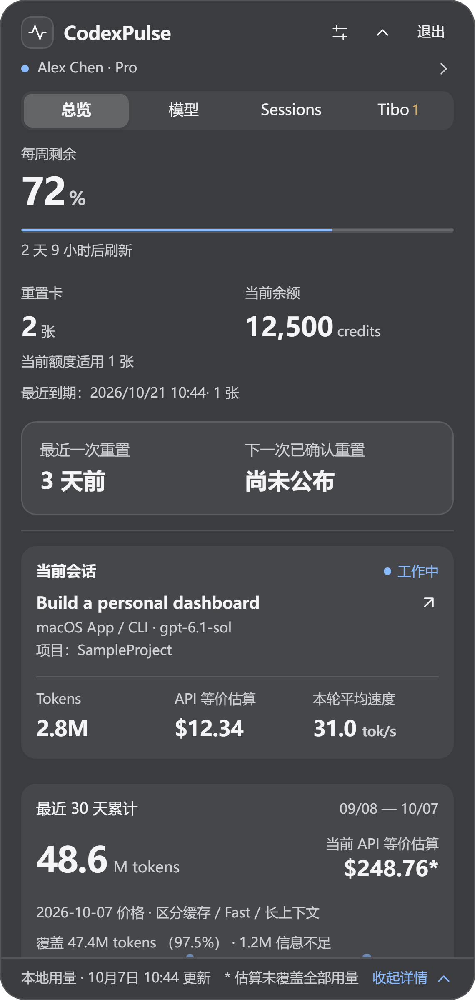
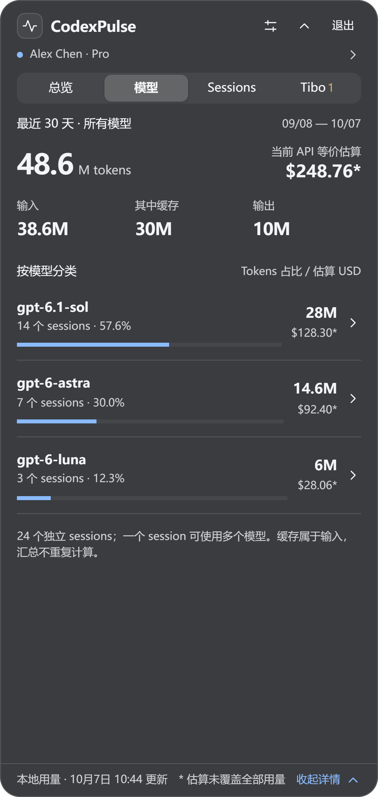
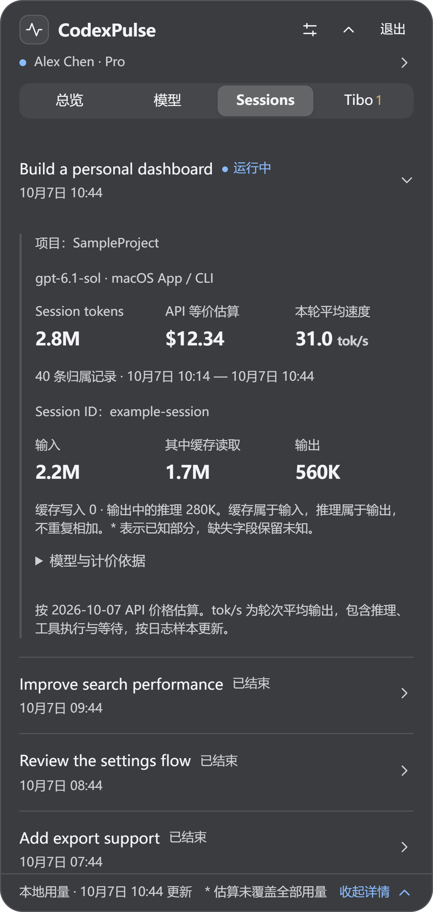
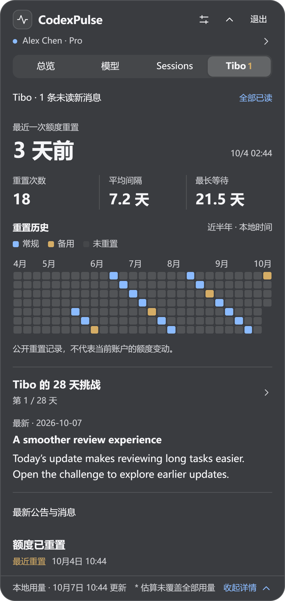

# CodexPulse

**中文** · [English](README.en.md)

把 Codex 的**账户额度、工作状态、Token 用量和重置动态**放到桌面上。

Windows 支持托盘与小浮窗，macOS 使用菜单栏面板。可采集 Codex App / CLI 的本地用量，Windows 也支持 WSL 数据源。

**[下载最新版本](https://github.com/lvzixun/CodexPulse/releases/latest)** · [界面与功能](#界面与功能) · [数据说明](#数据与统计口径) · [开发文档](docs/development/status.md)

## 安装与打开

| 平台                                  | 下载文件                      | 安装后怎么用                                       |
| ------------------------------------- | ----------------------------- | -------------------------------------------------- |
| **Windows 10 / 11 · x64**             | Releases 中的 `x64-setup.exe` | 安装后从开始菜单启动；点击托盘图标或浮窗打开详情。 |
| **macOS 12+ · Apple Silicon / Intel** | Releases 中的通用 `.dmg`      | 拖到 Applications，启动后点击菜单栏图标。          |

Windows 需要 WebView2 Runtime，安装器可按需安装。登录启动默认关闭，可在设置中开启。

当前 Windows 安装包未做 Authenticode 签名；macOS 包为 ad-hoc 签名，尚未进行 Developer ID 签名和公证。

## 日常怎么用

**Windows 小浮窗**收起后只有一行，显示工作状态、当前模型和平均速度；有新的重要重置消息时，显示醒目的「重置」标记。点击展开详情，拖动左侧调整位置。

<a href="docs/screenshots/compact-zh.png"></a>

浮窗可在设置中关闭。托盘左键打开同一个详情面板，右键提供设置、退出等简单操作。

**macOS** 保留菜单栏图标，点击即可查看详情。两平台共享以下功能。

## 界面与功能

截图使用虚构账户和示例数据，来自实际前端的开发预览；详情采用菜单栏布局。原生字体与毛玻璃效果会随平台、系统主题和桌面背景变化。图片以 **3 倍分辨率 PNG** 导出，点击可查看原图。

### 总览：先看额度，再看正在做什么

集中查看剩余额度、账户刷新时间、credits 和重置卡；公开重置信息靠前展示。当前会话显示模型、Tokens、API 等价费用和平均速度，向下滚动查看本机最近 30 天用量与账户累计。

<a href="docs/screenshots/overview-zh.png"></a>

### 模型：总量与分类一起看

查看最近 30 天的模型用量占比、Token 构成和 API 等价费用。点击模型展开明细，并继续查看相关 Sessions。

<a href="docs/screenshots/models-zh.png"></a>

### Sessions：正在运行的排在前面

会话按列表展示，标注运行状态；点击一行展开用量、费用、速度、项目和模型详情。

<a href="docs/screenshots/sessions-zh.png"></a>

### Tibo：重置消息与 28 天挑战

查看最新公开重置、重置观察与倒计时、近半年重置历史，以及 Tibo 的 28 天挑战和每日内容。消息支持点击翻译；公开公告不代表当前账户额度已到账。

<a href="docs/screenshots/tibo-zh.png"></a>

## 设置与刷新

- **外观**：深色、浅色或跟随系统；默认蓝色，可选紫色、青绿、琥珀和玫红。
- **独立刷新**：账户额度与 Codex Resets 消息分别设置自动 / 手动、刷新间隔，并可立即刷新。手动模式启动时显示缓存，不发起该组后台请求。翻译只在点击时请求。
- **按需采集**：Windows 仅在详情展开且可见时自动请求账户数据，小浮窗不触发账户请求；macOS 启动时执行首轮，之后在面板可见时按间隔请求。重新打开时按缓存期限决定是否刷新。本地日志采集与公开消息刷新独立运行。

## 数据与统计口径

- **用量范围**：本机统计来自可读取的 Codex 日志，账户累计来自服务端，分别标明范围。子代理不列入会话列表及数量，其 Tokens 和费用仍计入总量。
- **费用与速度**：API 等价费用按参考价估算，标明未覆盖用量，**不是订阅账单**。`tok/s` 为日志样本中的轮次平均输出速度，包含推理、工具与等待时间；缺少数据时显示 `—`。
- **本地数据**：用量账本保存在本机，不保存对话正文；个人资料仅在内存中保留。认证请求使用 Codex 的文件型凭据，不改写 `auth.json`，凭据不进入数据库或诊断输出。

## 开发

<details>
<summary>环境要求、运行与构建命令</summary>

需要 Rust stable ≥ 1.90、Node.js 24+ 和 pnpm 11；发布检查使用 Rust 1.97.1。Windows 需要 Visual Studio C++ 工具与 WebView2；macOS 需要 Xcode Command Line Tools。

```sh
pnpm install --frozen-lockfile
pnpm dev
```

检查与构建：

```sh
pnpm check
node --test apps/desktop/test/*.test.ts
cargo test --workspace
cargo clippy --workspace --all-targets -- -D warnings
pnpm build
```

macOS 通用包：

```sh
rustup target add aarch64-apple-darwin x86_64-apple-darwin
pnpm build --target universal-apple-darwin
```

Cargo 和 target 标准库须使用同一 Rust 工具链。通用包位于 `target/universal-apple-darwin/release/bundle`。

截图更新方法见 [截图说明](docs/screenshots/README.md)。

</details>

## 开发文档

- [产品与技术设计](docs/design/codexpulse-v1.md) · [实施状态](docs/development/status.md)
- [Windows 对齐与双平台发布](docs/development/windows-release-0.1.6.md) · [macOS 验证](docs/development/macos-2026-10-06.md)
- [开发交接](docs/development/handoff-2026-10-06.md) · [参考价与覆盖说明](resources/pricing/README.md)
