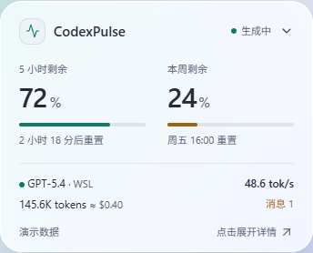
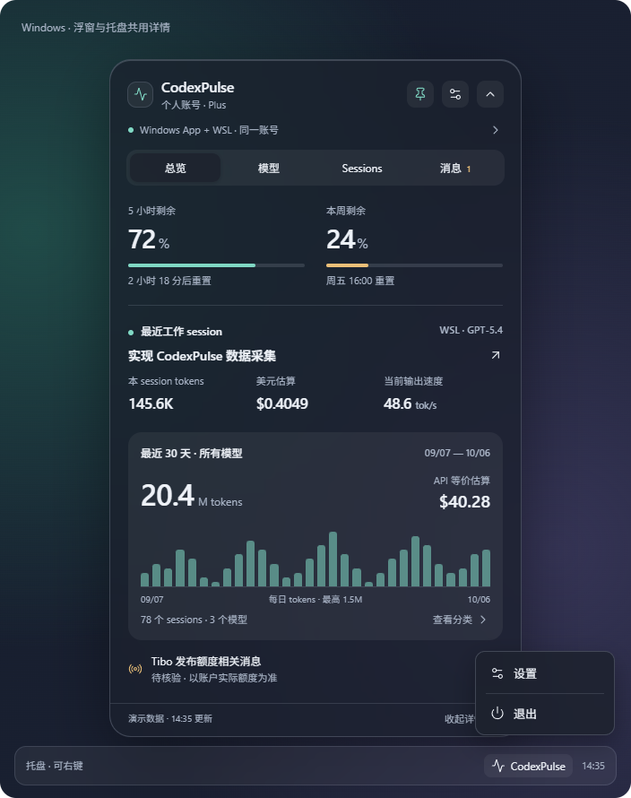
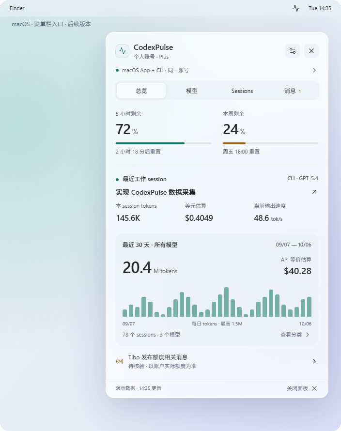
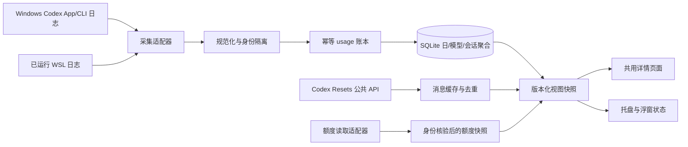

# CodexPulse v1 产品、UI 与技术设计案

| 项目     | 内容                                               |
| -------- | -------------------------------------------------- |
| 产品名称 | CodexPulse                                         |
| 设计日期 | 2026-10-06                                         |
| 状态     | 实施基线；开发进度见 `docs/development/status.md`  |
| 当前发布 | Windows x64 / macOS Universal 0.1.7 正式 Release，见开发状态 |
| 平台形态 | macOS 菜单栏面板；Windows 托盘与可选浮窗           |
| 产品形态 | 独立桌面状态伴侣，Windows 可选浮窗 + 系统托盘      |
| 技术方向 | Tauri 2、Rust、Svelte + TypeScript、SQLite         |

文档中的界面数据是示例；性能数字是工程验收目标，不能当作已测得的结果。具体依赖版本在建工程时验证并锁定。

## 最新需求对齐（2026-10-07）

本节覆盖下文和 HTML 原型中与之冲突的历史规划；下文平台首版表和性能预算保留为工程基线，不表示已验收。

- Windows 账户自动刷新只在详情展开且可见时执行，小浮窗 / 托盘启动无首轮请求；收起暂停，展开按原缓存期限及退避判断。macOS 保留启动首轮及之后隐藏暂停策略。已发出的请求可完成；Windows 收起后不派发后续子请求。手动模式不增加启动或周期请求。Resets 和本地采集独立运行。
- Windows 184 × 36 小浮窗显示活动状态、当前轮次模型、平均输出速度和重置 / 未读标记。无运行中会话或速度样本显示未知，不从历史模型列表推断当前模型；额度与 token 明细移至展开面板。浮窗右键仅提供「展开、退出、隐藏」三项，隐藏后可从托盘重新打开；托盘右键仍只提供设置与退出等简单操作。
- 子代理不进入会话列表、总览当前会话和会话数量；其 tokens / 费用仍保留在总用量。明确来源标记用于区分子代理，普通 fork 和未知标题不因此隐藏；旧数据只补读头部元数据进行分类，不全量重放。
- 当前交付 Windows x64 与 macOS Universal 正式 GitHub Release。macOS 继续 ad-hoc 签名，Developer ID / 公证延期；Windows 暂无 Authenticode。两平台共享总览、模型、Sessions、Tibo、刷新和偏好设置。Windows 登录启动使用当前用户 Run 项，读取系统禁用状态而不改写审批记录；卸载仅移除本安装拥有的启动项，保留账本。诊断两平台均按需生成与原生复制，Windows 同样使用有界固定字段窗口记录。
- 总导航为「总览 / 模型 / Sessions / Tibo」。不新增统计页签；当前 session 信息合为一组，最近 30 天与账户累计共用总览最后一个区域，区分本机与账户数据范围。删除 token 活动图。
- 顶部账户行显示姓名与级别；额度区展示重置卡数量、适用数量、最近到期和 credits。总览最近 / 下一次重置分别占一行，标签与结果同行；Tibo 页保留较大的「几天前」，精确时间作为辅助信息。美元金额加千分位。顶部提供退出按钮。
- Tibo 页直接展示最新重置、间隔统计及近半年历史，图表适应面板宽度。挑战一级显示最新详情，第二级展开每日内容；取消消息页内部分类 tabs。未读数仅统计新消息，历史条目数量不能冒充未读。
- macOS 使用原生圆角面板和 SF Symbol 菜单栏图标。背景恢复用户选择的原始透明度；系统关闭透明度或要求高对比度时使用不透明回退。
- 设置新增「跟随系统 / 中文 / English」语言选择，默认跟随系统，语言与外观选择立即保存并独立于其他设置草稿。系统模式按当前首选显示语言选择：`zh` 变体使用简体中文，其他未支持语言回退英文，不根据地区或 shell 的 `LANG` 推测。可见期间复用已有分钟时钟检测变化，重新打开时检测；托盘菜单同步更新。账户名称、用户标题和来源正文保留原文。
- API 等价估算使用当前版本参考价并展示覆盖限制，不代表订阅支出；速度显示有样本的本轮 / 上轮平均值，含工具等待。未知数据保持未知。

实现与发布证据见 [i18n 与发布记录](../development/i18n-release-2026-10-06.md)、[macOS 验证](../development/macos-2026-10-06.md)和 [实际状态](../development/status.md)。

## 1. 产品目标与已确认决策

用户可以在 WSL 的 CLI 和 Windows Codex App 中继续工作，CodexPulse 在 Windows 桌面集中展示状态。产品借鉴 CodexBar 的额度展示及 Codex Resets 的重置消息聚合，首发聚焦 Codex。

已确认决策：

1. Windows 提供系统托盘，并默认开启可关闭的桌面浮窗。
2. 单击浮窗或托盘图标，打开同一个详情窗口；选中的模型、session 和页面保持一致。
3. 托盘右键只显示设置、退出等简单操作，不在右键菜单内铺开统计面板。
4. macOS 仅提供菜单栏图标，点击展开详情面板；不提供桌面浮窗和浮窗设置。
5. 界面默认深色主题，可选跟随系统或浅色，提供现代毛玻璃效果、柔和阴影和清晰的内容层级。默认主色为蓝色：深色主题 `#8BBBFF`，浅色主题 `#2261D6`；设置提供蓝色、紫色、青绿、琥珀、玫红五种选择，并持久化。背景为冷调灰蓝，选中状态、品牌、额度条与图表统一使用所选主色；应用和托盘图标采用默认蓝色。
6. 用量先展示所有模型总计，再展示各模型分类。总量、费用、sessions 与速度都有明确口径。
7. 数据处理在后台完成；关闭详情不停止必要采集，隐藏 UI 不持续渲染。
8. 不提供系统通知、低额度或恢复提醒、免打扰、通知历史及通知设置；重置和 Tibo 动态在消息页查看，保留浮窗中的未读标记。

首版不承担聊天、发送 prompt、自动切换 Codex 模型、消耗重置次数、购买 credits、云端同步或团队管理。统计范围是已连接且可读取的数据源，不声称覆盖其他设备、未落盘内容或全部云端会话。

## 2. 版本范围

| 能力                                           | Windows 首版                            | 后续                 |
| ---------------------------------------------- | --------------------------------------- | -------------------- |
| 托盘单击打开共用详情、右键设置/退出            | 必须                                    | 保持                 |
| 可选浮窗、拖动、置顶、记住位置                 | 必须                                    | Windows ARM64 验证   |
| 系统主题、毛玻璃与不透明回退                   | 必须                                    | macOS 原生材质       |
| Windows App / 本机 CLI / 已运行 WSL CLI 数据源 | 必须，按已验证的版本与路径接入          | 可选 WSL 采集助手    |
| 额度窗口、恢复时间、数据时效                   | 必须，接口不可用时明确显示状态          | 更多额度桶           |
| 最近 sessions、token 与美元估算                | 必须                                    | 更长历史与导出       |
| 最近 30 天汇总及每模型明细                     | 必须                                    | 自定义日期范围       |
| 当前输出速度                                   | UI 与能力检测必须；有可用样本才显示数值 | 更细的 turn 指标     |
| 重置相关消息、最新重置及已确认计划             | 必须                                    | 扩展到更多官方消息源 |
| macOS 菜单栏                                   | 预留平台接口                            | 第二阶段实现         |

能力缺失是一个可表达的状态，不用虚构数字完成首版功能。例如：无法采到连续输出 token 样本时速度显示 `—`，同时说明原因。

## 3. 功能与统计口径

### 3.1 账号、来源与额度

数据源分别记录平台、Codex home、发行版、用户、连接状态、版本及最后成功读取时间。设置页能看到 Windows App、Windows CLI、WSL CLI 的采集来源；路径探测失败时可手动指定。

额度按 `account + workspace + limit_id + window` 分组。Windows 与 WSL 确认属于同一账户、同一 workspace 后共享额度视图，不把两个来源的剩余百分比相加。不同 workspace、模型额度桶或账号分开展示；无法确认身份时保留“身份未确认”，不因邮箱相同就合并。

界面显示：额度桶名称、窗口长度、剩余百分比、预计重置时间、最近同步时间及状态。`remaining = clamp(100 - usedPercent, 0, 100)`，缺失值为 `—`。5 小时和每周是常见示例，实际标签按来源报告的窗口长度生成，不硬编码套餐一定有这两个窗口。

倒计时来自服务端重置时间，客户端本地计算。到点变为“等待刷新确认”，不能直接把额度改成 100%。离线时保留最后有效快照，标注数据已过期。

### 3.2 最近工作 sessions

Sessions 使用单一列表，每页最多 10 条，提供双向游标分页。运行中的会话在全部匹配结果中优先，其余按最近活动时间排序；运行判断需要活动状态、最近 5 分钟的日志及已连接来源，旧日志或来源不可用时显示“状态未知”，明确结束的会话显示“已结束”。首屏捕获判断时刻并放入分页游标，翻页期间不因时间窗口自然推移而遗漏记录。后台数据更新后首屏重新读取。

收起行只显示标题、运行状态、最近活动时间和展开箭头，行间使用分隔线。点击某行就在其下展开来源、项目、tokens、费用及输入 / 缓存 / 输出，再次点击收起；同一时间只展开一个会话。模型拆分和计价依据进一步按需展开，保持默认列表简洁。仅展开的会话请求详情，模型及价格分类继续有界分页。

会话名称优先读取各来源 Codex home 的 `session_index.jsonl`，按 session ID 匹配 `thread_name` 并采用最新 `updated_at`，支持 Codex 中的重命名。标题作为独立元数据保存，后续用量日志不能覆盖它。索引缺失时可使用日志明确提供的标题；无标题时显示“未命名会话 · 短 ID”，项目目录只作为副标题，不冒充会话名，也不读取 prompt 猜测标题。索引使用与用量日志相同的有界增量读取；未变化文件不读取内容，半行等待追加，标题及其断点在同一事务提交。标题最多保存 512 个字符。

“当前 session”优先使用用户在详情中选择的正在运行会话；未指定时选择最近有活动的会话。有多个并行会话时显示数量和切换入口，详情打开后不因另一个会话更新而抢走当前选择。没有运行会话时显示“最近 session”和“空闲”。仅有旧日志且没有可靠结束事件时显示“状态未知”，不能凭超时断言已完成。

同一会话切换模型后仍是一个 session，详情按实际 usage 事件拆分模型。归档会话的统计继续保留。

### 3.3 Token 口径

| 字段             | 口径                                                     |
| ---------------- | -------------------------------------------------------- |
| 输入 tokens      | 来源报告的输入量，包含其中的缓存输入                     |
| 缓存输入 tokens  | 输入的子集；单独展示，但不额外加进总量                   |
| 输出 tokens      | 来源报告的输出量；推理 tokens 是否已包含由版本适配器说明 |
| 总 tokens        | 输入 + 输出；推理量若是输出子集不再次相加                |
| Session 当前用量 | 该 session 已归属、已去重的新增 usage 之和               |
| 所有模型总量     | 各模型桶及“未识别模型”桶之和                             |

缺少某项字段时保留 `null` 与完整性状态。知道总 tokens 但不知道拆分时，保留来源总量为“未拆分”数据，不用零补齐输入或输出。不能根据消息字符数反推真实 token 使用量。

### 3.4 美元估算

UI 使用“API 等价估算”或“美元估算”，明确它不是 ChatGPT/Codex 订阅账单，也不推断真实扣费。

标准文本计价公式（单价单位：USD / 百万 tokens）：

```text
uncached_input = input_tokens - cached_input_tokens
estimated_usd = (
    uncached_input × input_price
  + cached_input_tokens × cached_input_price
  + output_tokens × output_price
) / 1_000_000
```

例如采用仅用于测试的单价 `2 / 0.2 / 10`：输入 100,000、缓存 60,000、输出 10,000，估算为 `$0.1920`。这不是任何模型的当前报价。

价格表按 provider、模型/快照、服务档位、上下文档位、生效时间与币种匹配，记录来源和核查日期。事件采用事件时间对应的价格版本；历史价格缺失时允许使用已知参考价，但标注估算依据。后续显式重算生成新版本，不悄悄改写历史依据。

Fast/priority、长上下文或特殊计价不能只匹配一个模型名就套用标准价。缺少计价字段或未知模型时显示“未计价”。若只能确定部分费用，汇总显示“已计价部分 $X，另有 Y tokens 未计价”，不把未知视作 $0。累计值使用整数微美元或十进制定点数，展示时才四舍五入。[OpenAI 价格参考](https://developers.openai.com/api/docs/pricing)

### 3.5 最近 30 天及模型分类

默认范围为展示时区的今天及之前 29 个自然日，今天标注“进行中”。数据库保存 UTC 事件时间，按明确的 IANA 时区聚合；跨午夜 session 的 usage 按事件时间进入不同日期，不能全部归到会话创建日。

统计时区自动跟随系统，不提供选择或自定义入口。启动时及运行中每 60 秒检测系统 IANA 时区；保留当前已发布时区用于读取缓存，检测变化后自动后台重建日期汇总。检测失败或重建失败继续使用有效统计并提示，下一次检测重试。系统时区再次变化时替换旧任务，回到已发布时区则取消过期任务。重建只读本产品规范化账本，不重新扫描 Codex 日志；设置页不展示统计时区或本地数据隐私说明；系统时区在后台自动检测，发生错误时才按需提示。完成前保留旧时区统计，本地采集、额度 / 消息刷新和其他设置继续工作。每批最多 256 条、每轮 8 毫秒调度预算，批次之间让出执行；任务使用单写入连接的临时表及 rowid 游标，追上期间新增的 facts 后，将新日期桶和最新设置一起原子提交。退出或重建失败不发布中间结果；重启使用最后一次提交的时区并立即检测系统时区。切换完成重置 session 页游标并更新模型下钻日期范围。自然日边界处理午夜夏令时跳跃、重复时间和整日跳过，跨展示时区午夜时刷新 30 天范围。

总览包含总 tokens、美元估算、独立 session 数、模型数、每日趋势、采集覆盖状态。所有模型汇总在先，下方为每模型 tokens、输入/缓存/输出、估算费用及涉及 session 数。点开模型可查看明细和相关 sessions。

模型分类使用双向游标分页，每页最多 20 条，按总 tokens 降序、模型名升序稳定排列，未知模型及缺失计数的记录仍在分类中。顶部总计来自独立汇总，不是当前页相加；完整计数 / 部分缺失 / 全部未知分别显示数值、`*`、`—`，未计价记录按条数判断，避免未知 tokens 被误写为 `$0`。当前 30 天范围及系统时区写入游标；范围或时区变化后回到首屏。返回模型页、收起再展开、隐藏后重建 WebView 时，保留页游标、选中模型和滚动位置；异步分类加载完成后才恢复滚动。

首次读取捕获本产品不可变账本的 rowid 上限，后续页仅聚合此上限以内的事实，使后台追加不改变翻页中的排序或成员。首屏可自动更新，后续页发现新事实时提供“分类有更新 · 刷新列表”，主动刷新后开始新快照；顶部总计可继续更新。游标中的整数使用十进制字符串，避免 JavaScript 精度破坏分页边界。此协议依赖现有事实只追加、不修改；未来历史重算或纠错必须同步引入账本版本并使旧游标失效。

每个模型行显示细横条及 tokens 占比，强调色与主题一致。分母为同一日期范围、同一账本水位下全部模型的已知 tokens，通过分页查询同时返回，不能使用当前页合计或持续变化的顶部总计。部分缺失标注 `*`，全部未知不绘制零值条；存在缺失总量时说明图表按已知 tokens 计算。图表不增加轮询、额外模型查询或第三方图表依赖。

必须满足：

```text
所有模型 tokens = Σ 各模型 tokens（含未识别模型）
已计价总费用 = Σ 已计价事件费用（显示值不作为求和输入）
独立 session 数 = count(distinct canonical_session_id)
```

一个 session 使用两个模型，会分别出现在两个模型的 session 计数里，所有模型独立 session 数仍只算一次。账户级服务端汇总和本机日志汇总是不同覆盖范围，分开展示或用于对账，绝不相加。仅采到 12 天时展示“已采集 12 天/历史补采中”，不能把剩余日期当作已确认的零用量。

### 3.6 当前模型输出速度

只对选中、正在生成、且具备连续有效采样的 turn 展示速度。口径是观测到的输出 tokens 增长率，不承诺是模型内部纯解码速度。

```text
observed_tok_per_sec = Δoutput_tokens / Δelapsed_seconds
```

使用单调时钟，按同一 session/turn/model 分段，在 5–10 秒窗口内平滑。模型或 turn 切换时清空旧样本；来源累计计数要先规范化，再计算速率。优先排除已明确识别的工具等待；采样间隔包含等待且无法分离时标注“观测速度”。推理与可见输出若不能分开，注明来源口径。

连续样本不足、只拿到 turn 结束用量、断连或会话结束时显示 `—`。结束后的“本轮平均速度”若有可信时长，可在详情单独显示，不能继续冒充当前速度。输出文本 delta 本身不是 token 数，不做字符换算。UI 最多每秒更新一次。

### 3.7 Tibo 与重置消息

首版通过 Codex Resets 公开 API 接入其已经收录的 Tibo 重置相关公告；这不等于收录 Tibo 的全部动态。每条消息展示来源、原文链接、发布时间、采集时间和状态，数据旁保留 `Data from Codex Resets` 链接。

总览及消息页明确展示“最近一次重置”和“下一次已确认重置”。最近一次以状态接口的 `latest_reset` 为准，以本地时间显示公告时间；下一次只有 Tibo 公告提供未来 `scheduled_for` 时显示具体时间。未公布、已公布但时间待定、计划时间已过待确认和同步失败分别表达，不使用平均间隔或预测推算已确认时间。

总览将最近 / 下一次已确认重置信息放在额度之后、当前 session 之前。两项分别占一行，标签与结果同行显示，结果右对齐，不再将数值另起一行；长时间或状态文字单行省略，悬停可查看完整内容。有有效站点重置观察时，紧接其后展示独立的未确认观察与倒计时。不重复显示 Tibo 挑战入口。Tibo 页将同一观察置顶，显示最近线索正文及原文 / 翻译入口。观察仅来自状态接口 active_watch，按 expires_at 在本地倒计时，过期或出现更新的已执行重置即隐藏；预测不能替代已确认时间或证明当前账户恢复。观察独立于历史消息列表上限；状态请求成功、历史失败时保留新观察，历史仍标记失败及退避，沿用既有缓存 / Retry-After 和刷新调度。

补充接入 [Tibo 的 28 天挑战](https://codex-resets.com/zh-CN/tibo-28)。挑战公开 API 暂不提供数据，因此从该页面服务端 HTML 提取开始日期、28 天周期及每日记录，按 `America/Los_Angeles` 计算第几天。区分产品改进与额度重置，显示每日标题、摘要及原帖；每天“改进或重置”的承诺不等于每天必定重置。页面响应有界、尊重 ETag / no-store / Retry-After，解析失败保留旧缓存并标注，独立退避不拖延重置接口同步，不执行来源脚本或保存投票内容。

本次核查的公开接口为 `GET /api/v1/status` 与 `GET /api/v1/resets`，历史列表支持游标，响应支持 ETag。其数据区分已记录重置、计划重置与预测/watch；计划时间过去不代表执行完成。[API 文档](https://codex-resets.com/api/docs)、[OpenAPI](https://codex-resets.com/api/openapi.json)

产品状态分为：

| 状态            | UI 表达与行为                               |
| --------------- | ------------------------------------------- |
| 来源公告        | “Tibo 发布重置消息”；有原文链接             |
| 计划重置        | “已公告，等待执行”；不自行确认恢复          |
| 第三方观察/预测 | 显示来源与“预测/社区观察”，不当作已确认重置 |
| 计划时间已过    | “时间已过，待确认”；保留来源，等待后续公告  |

公告时间不代表本账户额度已到账，实际账户额度由独立 HTTPS 查询显示。换号、旧缓存及乱序结果仍由额度采集层隔离；不额外建立账户恢复提醒或延迟复核任务。

消息未读签名及已读状态持久化，首次建立历史基线，不将旧消息批量标为新消息。进入可见的 Tibo 页面并渲染快照后自动确认当前快照中的未读消息，停留期间刷新到的新消息同样自动确认；不提供单条或全部标为已读按钮。其他页面、隐藏面板及收起浮窗不确认已读；保存单飞，失败保留未读，不连续重试。重要重置消息在浮窗中保留醒目标记，点击进入共用详情的消息页；原文在系统浏览器打开。不发送系统通知，也不提供通知开关、低额度阈值、免打扰或通知历史。

消息提供“翻译 / 显示原文”按钮，先按稳定消息 ID 获取 Codex Resets 中文页面已发布的完整译文；不使用日历截断摘要，不将本地 session 内容发送给翻译服务。按需读取、有界响应、ETag 与限流共用后台网络调度；站点没有提供译文时明确提示，不能冒充已翻译。译文切换不因统计更新清空。重要重置公告及计划突出显示，预测、社区观察及挑战产品改进为普通动态。

## 4. UI 与窗口行为

### 4.1 Windows：一个窗口，两种入口

Windows 原生层维护一个 `pulse` 产品窗口，同一份 ViewModel 和路由支持紧凑浮窗、展开详情及设置。托盘菜单为原生菜单，不启动第二套详情页面或 WebView。

| 操作               | 结果                                                           |
| ------------------ | -------------------------------------------------------------- |
| 应用启动           | 创建托盘；默认显示紧凑浮窗，恢复安全范围内的位置               |
| 单击浮窗           | 原窗口展开到详情，保留锚点并避免越出屏幕                       |
| 单击托盘图标       | 创建/显示并激活同一个详情窗口，不产生副本                      |
| 再次打开详情       | 保留当前页、选中模型、session 和滚动位置                       |
| 右键托盘           | 原生短菜单：设置、分隔线、退出                                 |
| 托盘“设置”         | 共用窗口切换到设置页                                           |
| 收起详情，浮窗开启 | 返回紧凑浮窗                                                   |
| 关闭详情，浮窗关闭 | 隐藏窗口，保留托盘与后台采集                                   |
| 设置中关闭浮窗     | 当前设置可继续操作；退出设置/关闭详情后不留下紧凑浮窗          |
| 退出               | 关闭窗口和托盘，取消采集与网络任务，保存游标并退出所有自有进程 |

退出只停止 CodexPulse 及其启动的采集助手，不能终止用户正在工作的 Codex CLI/App 或关闭整个 WSL 发行版。

紧凑浮窗采用接近网盘状态浮窗的单行小条，名义尺寸 `184 × 36 DIP`，按 DPI 缩放并校正到工作区。活动区明确显示“忙 / 闲 / ?”，多个近期活动 session 显示数量；旧活动日志没有结束事件或来源不可用时为未知。额度区优先显示较长窗口（如每周），其他窗口在详情显示，避免撑宽。平时显示当前 session tokens；有未读重要重置消息时，这个位置优先显示醒目的“重置”及标记，普通新动态只显示小圆点。点击新消息提示打开共用消息页，已读操作只确认当前快照里的消息；未读状态持久化、首次同步建立历史基线、公告与挑战重复原帖只提醒一次。额度标签由来源窗口时长生成，快照过期显示 `*`。模型、精确 token 数与已计价费用可悬停查看。

Windows 程序的开发及发布构建都使用 GUI 子系统；WSL 与只读额度子进程隐藏启动，正常从程序或快捷方式启动不会产生终端。开发工具命令本身由开发者的终端运行。

```text
┌──────────────────────────────┐
│ ●忙  7d 24%  146K tok     ›│
└──────────────────────────────┘
```

拖动仅使用明确的标题/拖动区，不抢占按钮、文本选择与图表操作。默认置顶，可关闭；不默认穿透鼠标。位置保存为屏幕标识、逻辑坐标及边缘偏移，显示器拔出、缩放改变或远程桌面切换后校正到可见工作区。展开向可用空间延伸，收起回到原锚点，不把窗口跳到屏幕中央。

### 4.2 macOS：菜单栏图标

仅一个菜单栏状态图标，无桌面浮窗，默认不显示 Dock 图标。图标以单色模板图标适配菜单栏主题，可用小标记表达新消息或错误，不展示高频变化的数字动画。

单击菜单栏图标，在图标附近展开原生定位的详情面板；再次点击、Esc 或点击外部收起。设置属于同一面板路由，没有“显示桌面浮窗”和“浮窗始终置顶”。面板使用共享统计页面、macOS 字体及平台材质。设置与退出放在平台菜单/面板操作中。

窗口宿主接口分别为 `WindowsWindowHost` 和 `MacMenuBarHost`，统计页不判断 WSL、托盘坐标或系统菜单行为。

### 4.3 详情信息架构

详情建议宽 `440–480 DIP`。高度按工作区可用高度限制；实际桌面应用内容区域可滚动，页签与关键操作保持可见。窄窗口重排，数字不因缩小字号而不可读。

```text
品牌 / 账号             [置顶*] [设置] [收起/关闭]
来源摘要与同步状态
[总览] [模型] [Sessions] [消息]
当前页面内容
同步时间 / 数据完整性 / 收起或关闭

* 仅 Windows 浮窗模式
```

| 页面     | 布局与交互                                                                                                            |
| -------- | --------------------------------------------------------------------------------------------------------------------- |
| 总览     | 额度 → 最近 / 下一次已确认重置 → 当前/最近 session → session tokens、美元估算、输出速度 → 30 天所有模型汇总与每日趋势 |
| 模型     | 顶部所有模型总计及输入/缓存/输出 → 各模型 tokens 占比横条 → 点击展开分类详情 → 进入相关 sessions                      |
| Sessions | 运行优先的单一列表与分页 → 点击行内展开详情 → 按需展开模型与计价依据                                                  |
| 消息     | 最近 / 下一次已确认重置 → Tibo 28 天挑战进度与每日记录 → 公告、计划/预测；来源及原文入口；按需加载历史                |
| 设置     | 外观、Windows 浮窗开关/置顶、启动方式、数据源、采集状态及诊断；颜色放在最后                                           |

由模型下钻到 sessions 后，保留模型范围，提供“所有模型”返回入口。总览先给总量，细节按需展开，避免浮窗堆满全部信息。所有费用字段可查看计价版本和覆盖状态。

### 4.4 视觉规范

| 项目       | 设计要求                                                                                                                                                                                                                                                                                                                             |
| ---------- | ------------------------------------------------------------------------------------------------------------------------------------------------------------------------------------------------------------------------------------------------------------------------------------------------------------------------------------ |
| 外观       | 深色为默认；可选浅色、跟随系统；主题切换不触发重新扫描数据                                                                                                                                                                                                                                                                           |
| 材质       | Windows 优先验证原生 Acrylic/系统 backdrop；macOS 使用适合面板的原生材质                                                                                                                                                                                                                                                             |
| 毛玻璃实现 | 原生窗口负责桌面背景材质；WebView 使用适当透明底色。CSS `backdrop-filter` 不能被当作跨原生窗口模糊桌面的保证                                                                                                                                                                                                                         |
| 回退       | 用户关闭透明度、减少透明度、系统不支持或性能不达标时，切到主题一致的不透明背景                                                                                                                                                                                                                                                       |
| 色彩       | 冷灰中性色底；默认蓝色强调，设置可选择五种主色；低额度/待核验保留状态标签与图形，不只依赖颜色表达                                                                                                                                                                                                                                    |
| 字体       | Windows Segoe UI 系列；macOS 系统字体；常规正文 13–14 DIP，辅助文字至少 11–12 DIP                                                                                                                                                                                                                                                    |
| 数字       | 使用等宽数字，避免百分比、速度更新造成宽度跳动                                                                                                                                                                                                                                                                                       |
| 形状       | 原生浮窗与详情仅保留系统窗口的一层圆角及轮廓，WebView 不再绘制额外外框；阴影适度，不叠加多层大范围 blur                                                                                                                                                                                                                              |
| 布局与样式 | 详情以讨论中的 [HTML 演示](codexpulse-prototype.html) 为基准，采用品牌 / 顶部操作、来源行、四个分段导航、三列 session 指标、30 天汇总和底部收起入口；模型与 session 列表沿用演示排版。收起浮窗按最新要求改为 184 × 36 DIP 单行小条，覆盖原演示的大卡片浮窗。设置从顶部图标进入。颜色设置最后调整；数据缺失和部分计价必须保留真实说明 |
| 动效       | 展开/收起约 120–180ms，无循环呼吸动画；系统减少动态效果时取消动画                                                                                                                                                                                                                                                                    |
| 可访问性   | 系统高对比度下取消玻璃，保证文字对比；原生右键菜单、键盘操作、清晰焦点与屏幕阅读标签                                                                                                                                                                                                                                                 |

主题和材质检测属于平台层。初版不把动画窗口 resize 与复杂模糊叠加，必须实测拖动和 DPI 变化时的 GPU/CPU 开销。[Tauri 窗口 API](https://v2.tauri.app/reference/javascript/api/namespacewindow/)

### 4.5 空状态与异常状态

必须区分：未连接、未登录、来源暂停、接口不支持、数据过期、补采中、用量拆分缺失、未计价、速度无样本及真实零值。概览允许部分成功：WSL 暂停不清空 App 用量，消息 API 失败不影响本地 token 统计。

断开来源默认停止新采集并保留历史，历史明确标记来源；删除历史属于单独的明确操作。来源关闭、刷新失败与真实零用量不能共用一个“0”状态。

### 4.6 当前界面参考

以下为早期原型的静态截图，数据均为演示值。原始 [HTML 演示源码](codexpulse-prototype.html) 已保存，作为详情布局和样式基准；图中的大浮窗已由 §4.1 的 184 × 36 DIP 单行小条替代。详情为 380 × 800 DIP，小工作区允许收缩及内容滚动。颜色设置最后调整，当前默认蓝色；实现时保留数据完整性、计价和能力降级说明，不复制演示中的虚构数据。

Windows 紧凑浮窗：



Windows 共用详情与托盘右键菜单（深色主题）：



macOS 菜单栏图标与详情面板：



## 5. 技术架构

### 5.1 技术选择

采用 Tauri 2 做桌面宿主，Rust 做采集、规范化、数据库与调度，Svelte + TypeScript 做可复用 UI，SQLite 保存本地账本。Svelte 采用组件化页面，界面状态保持轻量；首版不引入大型图表库或多窗口管理框架。[Svelte 文档](https://svelte.dev/docs/svelte/overview)

Tauri 使用系统 WebView：Windows 为 WebView2，macOS 为 WKWebView。它仍有多进程开销；不因为没有捆绑 Chromium 就声称内存一定小。包体与常驻内存分别测量，WebView2 依赖由安装器检查。[进程模型](https://v2.tauri.app/concept/process-model/)、[WebView 说明](https://v2.tauri.app/reference/webview-versions/)

先使用一个桌面宿主 crate 和一个无 UI 的领域核心 crate。数据源、存储及性能先作为核心内部模块；需要独立生命周期、Linux 构建或复用边界时再拆 crate，避免先建大量空包。

### 5.2 数据流



领域核心不依赖 Tauri 或前端。UI 只接收有限的汇总、列表分页与选中详情，不读取原始会话 JSONL，不直接访问账户凭据。WSL 与平台窗口逻辑不进入前端统计组件。

### 5.3 线程、任务与 IPC

Rust 异步运行时管理网络、文件等待与调度；日志解析和历史补采放入有界工作队列。一个数据库写入者按事务提交，读查询短事务执行。UI/平台事件线程不做 JSON 解析、WSL 调用和数据库补采。

IPC 定义版本化 DTO：`OverviewSnapshot`、`ModelPage`、`SessionPage`、`SessionDetail`、`NewsPage`、`SourceHealth`。启动请求快照，后续按订阅页面推送小范围变化，使用 revision 丢弃旧响应。前端限制事件合并频率，退出时取消订阅。

原生托盘右键操作由宿主处理。设置页使用同一个产品窗口；右键菜单保持原生轻量菜单，不嵌入统计内容。[Tauri 托盘支持](https://v2.tauri.app/learn/system-tray/)

## 6. 数据采集与兼容性

### 6.1 接口事实与工程假设

官方 app-server 文档列出额度读取、账户汇总、历史线程读取和 thread token usage 通知。实际使用须按用户安装版本生成/核查 schema，并探测能力；文档同时标记部分接口/传输为实验性质。新建一个 app-server 进程不能保证自动收到用户另一个 CLI/App 进程的 usage 通知。[官方 app-server 文档](https://learn.chatgpt.com/docs/app-server)

首版把这些作为可验证的适配入口，不将当前文档视为所有安装版本的保证。额度适配器只允许读取类请求；不为监控调用 `thread/resume`、开始 turn、改写会话、消耗 reset credits 或发送消息。

本地 JSONL 路径及 token/model 事件在 CodexBar 的源码文档中有实践记录，可以作为初始兼容线索；实际 Windows App 与 WSL 样本仍必须验证。初始候选 roots 是指定 Codex home 下的 `sessions` 与 `archived_sessions`，home 尊重各环境的 `CODEX_HOME`，不写死用户目录。[CodexBar 采集说明](https://github.com/steipete/CodexBar/blob/main/docs/codex.md)

### 6.2 Windows App 与本机 CLI

来源向导探测已知目录及指定 CLI，展示将读取的来源，支持覆盖路径。App 若使用另一个存储根，将其作为单独来源注册；不能默认 App 和 CLI 一定共用目录。

当前来源配置提供默认 Windows home 覆盖及最多 8 个额外 Windows 来源，每项保存稳定 ID、显示名称、本地绝对路径及启用状态。额外来源受 Windows 总开关控制；移除或停用配置只停止采集，历史账本保留。监听只将 `sessions`、`archived_sessions` 和标题索引的 JSONL 变化入队；配置切换清理旧队列及不再使用的目录监听。来源切换与额度缓存失效在同一事务保存，过期网络结果必须匹配仍有效的来源 ID、目录及 WSL 用户。

本地用量优先从已验证的日志适配器采集。Windows 文件通知只作为“可能变化”的信号，合并 200–500ms 后检查游标并读取新增完整记录。目录变化重新索引受影响范围；低频元数据校验负责修复通知丢失。

额度使用 `GET https://chatgpt.com/backend-api/wham/usage`，携带本次从来源 CODEX_HOME 读取的 Bearer 凭据及适用的 `ChatGPT-Account-Id`。接口固定 HTTPS、验证证书、禁止携带认证跟随重定向，网络请求全程 15 秒超时。失败只显示明确状态及退避，不启动 CLI / app-server 备用路径。Session、tokens 和费用继续读取本地增量日志。

2026-10-06 最终决策：改为上述 HTTPS 方式，不走 CLI。每次请求重新读取凭据和确认账号，请求前隔离不同身份缓存，返回后重新确认凭据修订；换号期间旧响应不得进入视图或缓存。Windows 认证 / 配置 / `.env` 文件变更通知及每 5 秒本地身份探测负责及时失效，WSL 同样进行本地探测；手动模式的探测不发送网络请求。探测未变化时不写 SQLite 或推送 UI。启动缓存先隔离，身份核验通过后才展示同账号额度。设置变更 / 来源切换使网络任务 generation 失效，旧传输返回前仍占用单飞槽，避免重叠。

认证存储先检查 `cli_auth_credentials_store`：支持文件；`keyring` / `auto` / `ephemeral` 明确显示系统凭据库未支持或内存凭据不可读取，不冒用可能过期的文件缓存。API key 等其他登录方式、自定义后端、凭据过期、401、账号不符和接口格式变化分别显示状态，不自行刷新认证。凭据只在内存使用，不记录 token、邮件或账号 ID，不写入产品数据库或原 Codex 文件。

代理按每个来源的 CODEX_HOME `.env` 读取 HTTPS_PROXY / https_proxy、ALL_PROXY、HTTP_PROXY 及 NO_PROXY，支持 HTTP CONNECT 和 SOCKS；Windows 没有本地值时可继承本进程环境，WSL 使用其来源文件。HTTPS_PROXY 优先，NO_PROXY 匹配时直连。显式代理无效则显示配置错误，不悄悄绕过；代理值 / 密码不写日志或数据库。旧 CLI 数据仅用于[实测对照](../development/cli-refresh-benchmark-2026-10-06.md)。

CodexPulse 不直接写入原 Codex 认证、配置、日志或内部数据库；认证过期提示用户在相应环境重新登录。不能因为 Windows 已登录就把其 token 文件复制到 WSL。

### 6.3 WSL

首版不要求在 WSL 启动 CodexPulse UI，也不要求用户改变 Codex 工作流程。

1. 来源配置明确选择发行版、用户与 Codex home，首次按需解析路径并缓存。
2. 只对已运行且已启用的发行版采集；通过已验证的 Windows/WSL 文件路径访问策略读取指定 roots。访问前检查运行状态，不能为轮询自动唤醒已停止的发行版。
3. WSL/UNC 文件通知可靠性需要实测；不可靠时对已知活动文件和近期目录进行有界元数据轮询，仍只读取新增字节。
4. 不每秒调用 `wsl.exe`，不反复递归列目录，不为每次获取速度启动 Linux 进程。
5. UNC 模式不能提供足够实时性时，将速度标为不可用/采样稀疏。第二阶段再提供用户启用的轻量 Linux 助手，用 inotify 和长连接发送规范化增量，不发送会话正文。

助手属于单独可选构建产物，通过本机管道/父子进程 stdio 通信，不默认开放公网端口。发行版停止后暂停重试；重新运行后从游标恢复。启动状态检查、UNC 超时及恢复行为必须用真实 WSL 验证，不承诺所有发行版都支持同一监听机制。

当前手动配置最多 8 个 WSL 来源，填写发行版、Linux 用户（空值为默认用户）及 Linux 绝对路径。手动来源与默认用户的自动探测独立；只采集指定目录时关闭自动探测。日志和额度凭据使用指定 home 的 Windows 可访问 WSL 路径读取，Linux 用户用于来源身份匹配，不复制认证信息。自动路径首次解析后缓存，30 秒轮询只查询运行列表；配置变更清除该缓存。停止的手动发行版显示“发行版已停止”，运行列表不可用时显示“无法确认运行状态”，两种状态均不读取文件或安排额度请求。读取前检查与发行版停止之间仍有竞态，UNC 超时和真实多用户权限需要后续实测。

### 6.4 Codex Resets

Rust 网络适配器读取公开 JSON，不加载隐藏网页或持续运行浏览器。默认每 5 分钟刷新状态；历史首次加载 20 条，后续使用游标/时间范围按需增量同步。遵守 `Cache-Control`、ETag、`304` 与 `429 Retry-After`，不能将建议频率凌驾于服务端限制。

原文链接校验协议及来源域，外部文本按纯文本展示，不执行源站 HTML。没有公开数据时保留缓存并标注过期，原文入口仍可用。首版不接入 X 页面自动化或自建 LLM 消息分类，避免不必要的资源、凭据及模型调用。

### 6.5 能力矩阵与降级

| 适配器能力             | 成功时               | 不支持/异常时                            |
| ---------------------- | -------------------- | ---------------------------------------- |
| 本地 session 读取      | 用量、模型与近期历史 | 展示路径/版本错误，其他来源照常工作      |
| 账户身份与额度读取     | 账户范围额度快照     | 本地统计继续；额度显示未登录/不支持/过期 |
| 连续 output usage 样本 | 当前观测速度         | `—`，注明采样不足                        |
| 账户级日用量           | 独立范围对照数据     | 隐藏该能力，不改变本地账本               |
| 消息 API               | 重置相关公告         | 缓存与原文链接；不冒充最新数据           |

每个适配器输出 `source_version`、`parser_version`、能力集合、状态、时间戳及 coverage。版本升级后保留旧账本，先检测兼容再切换，避免一次解析失败清空所有历史。

## 7. 去重、规范化与存储

### 7.1 幂等账本

一个记录应包含来源根、文件身份、会话/turn 标识、事件身份或稳定顺序、模型、事件时间、计数类型、输入/缓存/输出及可用身份范围。解析器明确来源记录是增量、累计快照还是末次 usage。

累计值只与同一连续计数 epoch 的前一有效累计值求差，不把每条累计值再次求和。切换模型仍先沿同一累计序列求新增，再把新增归给事件所属模型，不能分别按模型维护累计基线导致重复统计。计数下降、截断、fork 或换页需要显式重建基线；不能简单 `max(delta, 0)` 掩盖所有异常。

同一 JSONL 从 App/WSL 镜像、移动至归档或重复导入时只贡献一次。优先用稳定的 session/turn/event 身份；缺失时使用版本化规范化指纹。路径与 byte offset 仅是读取游标，不作为跨副本事件身份。标题、模型、tokens 相同不足以判定两个独立会话重复。

fork/subagent/历史分页需要区分继承上下文与新消费量。继承累计快照不新增消费，子会话自己的新增用量进入账本。父子事件已覆盖同一消费时不能再加两遍；没有所有权证据的记录暂列“待归属”，保持可重算。不同来源报告同一事件但数字冲突时保留冲突状态并按已验证的来源优先级选择，不相加。

旧 session 的账户归属不能用“今天的登录账号”反向填充。缺少事件时身份证据的历史保留本地来源范围或未知账号；账户切换必须创建新的采集身份 epoch。

### 7.2 最小数据模型

| 表/实体                     | 责任                                                           |
| --------------------------- | -------------------------------------------------------------- |
| `sources`                   | 来源、能力、Codex home、发行版/用户及健康状态                  |
| `identity_epochs`           | 账号/workspace 证据、来源归属与生效区间                        |
| `file_cursors`              | 文件身份、已提交 offset、半行缓冲、基线与 parser 版本          |
| `sessions`                  | canonical session、标题/项目简称、来源关联与活动状态           |
| `session_titles`            | 独立索引标题及更新时间，不被 rollout 元数据更新覆盖            |
| `usage_facts`               | 去重后的消费事实、原始计数类型、模型、时间、价格依据及质量状态 |
| `daily_model_usage`         | 日期/时区/来源范围/模型的物化 tokens 和已计价费用              |
| `session_model_usage`       | 每 session 每模型的增量聚合                                    |
| `pricing_versions`          | 生效时间、模型档位、定点单价、来源与版本                       |
| `quota_snapshots`           | 账号/workspace/额度桶的有效快照                                |
| `news_items` / 消息已读状态 | 消息、状态、ETag/游标及持久化未读签名                          |
| `settings`                  | UI、显示时区、数据源开关和采集选项                             |

消费事实、游标与聚合变更必须在同一事务中提交；崩溃不能出现“游标向前而账本没写入”。重复事实以唯一约束保证幂等，插入未生效的重复记录不得再次增加聚合。

SQLite 使用 WAL，单写入者与短读事务，索引覆盖范围+事件时间、session+模型和分页排序。周期 snapshot 只返回所有模型总计、模型数、账本修订值、30 个日桶及有限近期 sessions；模型分类通过独立 IPC 按需返回，每页最多 20 条，不能把全部 `usage_facts` 或全部模型列表发送给 WebView。schema 5 为日期范围、模型、session 和计数字段提供覆盖索引，模型页一次 grouped 查询完成分类计数，不为每个模型额外查询 sessions，也不解码事实 JSON。覆盖索引增加写入和磁盘成本，需要同时报告导入耗时及数据库大小。

文件末尾未完成的 JSON 行暂存，写完整后再解析。流式提取必要字段，对巨大正文记录进行有界跳过；必要 usage 字段因格式/大小无法读取时标注缺口，不能无声丢失。文件被替换/缩短时按新身份重扫，再由事实去重保护总量。

### 7.3 保留与重算

默认保留 90 天细粒度 usage 事实与必要 session 元数据，30 天额度快照、180 天消息，价格版本保留至引用事实清理。更旧的本产品统计缓存可在维护时合并/清理；不删除用户的 Codex 日志。

首次优先补采最近 30 天及跨边界活动会话。未知覆盖范围期间明确显示“补采中”；长 session 文件名日期早于 30 天仍可能有本月消费，需要根据事件时间验证。时区改变重建本产品聚合，不重新扫描会话正文。解析器升级只重处理受影响记录/文件；支持通过已配置来源重建本产品缓存。

## 8. 性能设计与预算

### 8.1 主要原则

性能目标不仅是详情打开时流畅，还包括一天常驻的 CPU、内存、磁盘、网络、GPU 与 WSL 唤醒行为。默认策略：事件驱动、追加读取、增量聚合、有限并发、缓存先呈现、不可见不渲染、玻璃可降级。

不把采集逻辑放进前端，不按秒全量扫描 JSONL，不为速度频繁创建进程，不后台加载 ChatGPT/X 网页，不维持无用的 render loop，也不把 token 数据拿去再请求 LLM 分类。

### 8.2 性能验收目标

基线：Windows 11、8 逻辑核、16GB 内存、SSD、100%/150% DPI；Release 构建，1 个 Windows 来源 + 1 个已运行 WSL 来源，10,000 个 sessions / 100,000 条规范化 usage 事实。首次导入、平稳常驻及 RPC 峰值分开测量。

| 指标                     | 初始验收目标          | 测量口径                                                               |
| ------------------------ | --------------------- | ---------------------------------------------------------------------- |
| 仅托盘空闲内存           | ≤ 60 MiB              | 无已加载 UI 时的进程组私有工作集 P95，包含自有助手                     |
| 浮窗常驻/详情暖态内存    | ≤ 180 MiB             | 主进程、归属的 WebView 子进程及助手的进程组私有工作集 P95              |
| 按需额度 RPC 峰值        | ≤ 350 MiB             | 临时自有 Codex/RPC 子进程也计入；达不到则调整接入/调度，不从报告中排除 |
| 稳态内存漂移             | 8 小时后增加 ≤ 10 MiB | 同状态、完成预热/GC 后比较；排除有界历史增长须单独解释                 |
| 仅托盘空闲 CPU           | 平均 ≤ 0.5%           | 8 核机器总 CPU 容量归一化，连续 10 分钟，含消息/额度刷新周期           |
| 紧凑浮窗空闲 CPU         | 平均 ≤ 1%             | 同上，包含材质合成影响；GPU 另记录                                     |
| 无变化日志读取           | 日志正文 0 字节       | 只允许有限元数据检查，不把目录 stat 当正文读取                         |
| 稳态 30 天查询           | P95 ≤ 100ms           | 物化聚合读取，冷/暖 SQLite cache 分开报告                              |
| 暖态打开详情             | P95 ≤ 250ms           | 点击到显示缓存可交互内容，不等待网络                                   |
| 冷态创建详情             | P95 ≤ 1.5s            | WebView 从未加载或已释放的状态，包含初始化                             |
| Windows 活动数据可见延迟 | P95 ≤ 1.5s            | 完整 usage 记录落盘到 UI 更新；不包括来源未写出的时间                  |
| WSL 活动数据可见延迟     | 首版 P95 ≤ 15s        | 有界轮询模式；不具备连续样本时不承诺实时速度                           |
| UI token/速度更新        | 最多 1 次/秒          | 合并多来源事件，无事件不重渲染                                         |
| 历史补采额外内存         | ≤ 32 MiB              | 流式读缓冲/队列增量，不随原始文件总量线性增长                          |

以上目标需要原生应用实测；浏览器原型通过不能证明 WebView、玻璃或 WSL 的资源达标。包体单列应用安装包与 WebView2 安装依赖，不拿包体大小替代内存指标。

### 8.3 调度策略

| 任务                     | 正常状态                                  | 不可见/空闲/异常                                                  |
| ------------------------ | ----------------------------------------- | ----------------------------------------------------------------- |
| Windows 追加采集         | 文件通知 + 200–500ms 合并                 | 低频 60s 元数据修复；通知可靠时不轮询正文                         |
| WSL 元数据轮询           | 有活动 2–5s；稳定空闲 15–30s              | 最长退避至 60s；停止发行版不访问、不唤醒                          |
| 额度刷新                 | 默认 300s，使用用户配置间隔，与可见性无关 | 手动模式无启动 / 定时请求；失败退避上限 30min，Retry-After 可延长 |
| 临近额度重置             | 进入边界后按预算复核                      | 公告只触发一次合并刷新，不连续追问                                |
| Codex Resets 状态 / 挑战 | 默认 300s，独立配置间隔                   | 手动模式无启动 / 定时请求；遵守缓存 / ETag / Retry-After          |
| 输出速度                 | 有有效样本则计算，UI ≤ 1Hz                | 无活动样本清空显示，隐藏 UI 不发渲染事件                          |
| 倒计时                   | 可见时按所显示粒度刷新                    | 仅显示分钟时不按秒唤醒，隐藏后停止 UI timer                       |
| 历史补采                 | 最多 2 个解析 worker，有活动数据时让路    | 电池/节能状态减少并发并暂停非必要补采                             |

所有远程刷新按账号/workspace single-flight，重复请求共享结果；每个源只有一个增量读取任务。手动刷新有短冷却与超时。任务延迟加入轻微 jitter，不同来源不在同一秒集中启动子进程。

设置中提供 Codex 账号额度与 Codex Resets（重置公告、Tibo 消息、28 天挑战）两个独立分组。每组用一行展示名称、频率下拉框和刷新按钮；下拉框合并“手动”和“每 30 秒 / 1、5、15、30、60 分钟”，选自定义才显示 30–86400 秒输入。下方仅显示最近成功时间，刷新中状态合并进按钮，退避和失败按需显示；不重复展示“刷新方式 / 自动刷新间隔 / 等待自动刷新”或正常连接的实现细节。此处修改立即持久化，不依赖外观的保存按钮，外观草稿保存不会覆盖新的刷新配置。用户间隔替代硬编码额度周期。手动模式不在启动或定时器中请求，允许显示带时间的已核验缓存；Session 本地增量采集及点击触发的翻译保持独立。连续刷新合并，设置 / 来源变更和退出取消或忽略旧结果，保留超时、失败退避及服务端缓存 / Retry-After 限制。Codex Resets 最新状态按用户配置间隔进行条件校验，缓存 max-age 不作为禁止重新校验的服务端等待；历史单独复用缓存，出现新公告或缓存到期时重取，历史失败不阻止最新公告显示。手动刷新使用条件请求，可以重新尝试本地失败退避；保留服务端 Retry-After / 限流等待，连续手动点击合并并保持至少 30 秒间隔。

WSL 阶段的“轮询”只对已有活动文件与近期目录做有限检查；历史 roots 的遍历另作为有预算的发现任务，不按该频率全树扫描。挂起恢复后清空速度单调时钟样本，并进行一次游标/额度对账。

### 8.4 内存、数据库与渲染

- 仅托盘且浮窗关闭时，后台服务不依赖 UI 窗口存在。详情按需创建；隐藏 5 分钟后尝试释放 WebView，UI 路由和选择状态由宿主快照保存。必须验证 WebView 子进程是否实际释放。
- 浮窗和详情同一宿主窗口切换，不同时养两份 renderer；托盘右键菜单不实例化 WebView。
- 每个读取缓冲初始约 64KiB，解析 worker 最大 2 个；队列按文件标识合并，原始事件内存按字节设置 8MiB 上限。队列满时合并“文件待处理”信号并施加背压，不丢消费事实。
- 长文件解析分片让出执行权，批量事务以 250ms 或 256 个事实为初始上限，参数通过压测调整。写入成功与游标推进必须保持原子性。
- `daily_model_usage`、`session_model_usage` 只更新受影响桶。关闭页面取消订阅，当前页只接收 revision 变化；页面首次请求先返回缓存。
- sessions 采用稳定游标分页，首屏 10–20 条；条目很多时用窗口化列表。30 天图用简单 SVG/轻量原生绘图，30 个日桶不引入大型图表依赖。
- 价格/时区/解析器版本变化触发有界后台重算，显示重算中与旧有效结果，不锁住界面。
- 玻璃只作用于一个有限尺寸窗口，避免玻璃层嵌套和背景持续动画；拖动、缩放和远程桌面若有性能回退，自动/手动使用不透明材质。

### 8.5 网络与进程生命周期

每类外部请求有超时、并发上限、取消 token、响应体大小上限与退避。缓存保留最后有效结果；一次大消息响应不能无限占内存。首版不承诺直接获取 Tibo 的所有 X 内容，因此不为这项能力启动额外浏览器。

临时 RPC 进程通过明确 argv 启动，不拼接用户路径进 shell 命令；仅管理本产品启动并验证归属的进程。正常关闭 stdio 后等待短暂退出，超时终止自有进程。系统退出/用户退出时停止新任务，提交当前事务，未完成记录由持久化游标下次重放。

退出清理设置 3 秒总预算；不等待全量补采完成。预算内未完成的读取保持旧已提交游标，下一次启动幂等重放，避免为了快速退出把游标推进到未落库的数据。

WSL 助手若未来启用，其进程占用也计入产品预算；不能通过把工作放到 WSL 就从性能统计中隐去。调度自有任务不能重启用户 Codex daemon 或中断正在运行的 sessions。

## 9. 本地数据与边界

数据库、配置与日志保存在平台应用数据目录，不能写到用户项目或 Git 仓库。Windows 使用应用专属 LocalAppData 根；macOS 使用 Application Support 与相应日志/缓存目录。

默认只保存统计、来源标识、简短标题/项目元数据及必要归属证据，不复制整段 prompt、生成代码或完整会话正文。标题可能包含敏感内容，设置提供隐藏标题/项目名称；诊断导出默认脱敏。

隐藏标题和项目名称分别设置，保存后在总览 / 列表 / 详情及悬停文本生效。后台返回界面的 session 元数据会去掉对应字段，前端还对已加载的详情同步隐藏；本地统计和原有标题元数据保留，关闭隐藏后可恢复名称。

网络只携带必要的额度请求信息与公开消息读取参数，不上传本地 token 账本或会话内容。前端拿不到认证文件/token；如后续出现自有凭据，使用平台安全存储。Tauri capabilities 限制 IPC 与外部打开能力，内容不可任意调用 shell/文件命令。

## 10. 仓库结构

采用单仓库、共享领域核心与薄平台宿主。规划如下；没有实现的目录在需要时创建，不为完整树预先生成空文件。

```text
CodexPulse/
├─ README.md
├─ .gitignore
├─ docs/
│  ├─ design/
│  │  ├─ README.md
│  │  ├─ codexpulse-v1.md
│  │  └─ assets/                    # 设计图与界面截图
│  ├─ adr/                         # 重大技术决策，实施时添加
│  └─ development/                 # 本地构建、兼容版本与性能测量
├─ apps/
│  └─ desktop/
│     ├─ package.json              # 前端构建与开发脚本
│     ├─ src/
│     │  ├─ components/            # 浮窗、共享页签与状态组件
│     │  ├─ pages/                 # Overview / Models / Sessions / News / Settings
│     │  ├─ stores/                # ViewModel 与页面订阅
│     │  ├─ ipc/                   # 生成的 DTO 及封装，不存业务计价逻辑
│     │  └─ styles/                # 明暗主题、平台 token 与不透明回退
│     ├─ public/                   # 本地静态资源
│     └─ src-tauri/
│        ├─ src/
│        │  ├─ commands/           # 窄 IPC 入口
│        │  └─ platform/           # Windows 托盘/窗口、macOS 菜单栏宿主
│        ├─ capabilities/          # 最小 IPC 权限
│        ├─ icons/
│        └─ tauri.conf.json
├─ crates/
│  ├─ pulse-core/
│  │  ├─ src/
│  │  │  ├─ domain/               # 使用量、session、quota 与消息类型
│  │  │  ├─ collectors/           # Codex JSONL、RPC、WSL、Resets API 适配
│  │  │  ├─ ledger/               # 去重、累计差分与继承归属
│  │  │  ├─ pricing/              # 价格版本及定点计算
│  │  │  ├─ storage/              # SQLite 查询、物化聚合与游标
│  │  │  └─ scheduler/            # 有界任务、single-flight 与退避
│  │  └─ migrations/              # 本产品数据库迁移
│  └─ pulse-wsl-agent/             # 第二阶段可选 Linux 助手
├─ resources/
│  └─ pricing/                     # 可核查的内置价格版本与来源
├─ tests/
│  ├─ fixtures/                    # 脱敏、合成、多版本日志/API 样本
│  ├─ integration/                 # 崩溃恢复、跨源重复及采集兼容
│  ├─ e2e/                         # 共用窗口、托盘、菜单栏与主题
│  └─ performance/                 # 数据生成器、基线与报告格式
├─ scripts/                        # 开发、打包、生成 schema/DTO
├─ .github/workflows/              # 按实际托管平台启用
├─ Cargo.toml                      # 实现阶段创建 Rust workspace
└─ pnpm-workspace.yaml             # 实现阶段创建前端工作区
```

Rust workspace 包含核心与桌面宿主；pnpm 负责前端依赖。具体工具链版本和 lockfiles 在工程初始化时提交。数据库 migration 只有一个所有者，公共 DTO 由 Rust 定义生成，前端不另写一套易漂移的 schema。

## 11. 实施顺序与验收

### M0：验证接入与性能边界

取得 Windows App、WSL CLI 的脱敏真实样本，确认 home、事件、模型切换和会话身份；核查安装版本的额度读取能力。验证 Tauri 原生玻璃、同窗口切换、WebView 释放、WSL 监听/轮询与不会自动唤醒停止发行版。

输出兼容矩阵、样本 fixtures 和首次性能基线。若额度 RPC 或玻璃无法达到预算，先调整适配策略/材质，不扩大到未验证的全面接入。

### M1：Windows 完整首版

完成幂等账本、日/模型聚合、价格版本、Windows 托盘 + 可选浮窗、共用详情、设置及消息 API。支持离线缓存、暂停来源、迁移/崩溃恢复、安装器和性能测量。速度只在有效采样能力存在时启用。

### M2：macOS 与增强采集

实现菜单栏宿主与原生材质，复用核心和统计页面；按 WSL 首版测量结果决定是否上线可选助手。macOS 构建、权限、后台内存和材质需要独立平台验收。

### 正确性验收

| 场景                                           | 必须满足                                           |
| ---------------------------------------------- | -------------------------------------------------- |
| 同一日志被两个来源读取/归档移动/重启重读       | 总量不增加第二次                                   |
| 累计计数重复、回退或模型 A→B→A                 | 正确基线、模型归属与异常标记，不重复计数           |
| Session fork/subagent/分页继承                 | 只增加自己拥有的新消费，未知归属可见               |
| 一个 session 跨午夜、换模型                    | 分日与模型正确；独立 session 仍只算一次            |
| 未知模型、缓存缺失、部分费用可计价             | tokens 不消失，费用不伪装成完整或零                |
| 账号/workspace/套餐切换                        | 不混入其他身份额度，不给旧历史反向填账号           |
| 部分 JSON 行、巨大正文、文件截断、进程中途退出 | 可恢复，无游标越过未提交事实                       |
| 公告到达但账户未恢复/计划已过时                | 公告与实际账户额度独立展示，过时计划等待新公告确认 |
| 所有模型视图                                   | 分模型之和可对账，费用用未舍入值求和               |
| 停止 WSL/拔出屏幕/更改 DPI/休眠恢复            | 不唤醒发行版、浮窗可见、旧速度样本清空             |

### UI 与性能验收

1. 浮窗/托盘反复打开后只有一个 Windows 详情窗口，页面选择一致；右键是原生短菜单。
2. 关闭浮窗可只使用托盘；退出后无本产品进程残留，不影响 Codex 与 WSL 工作。
3. macOS 关闭面板只保留菜单栏图标，不出现 Windows 浮窗设置。
4. 浅色、深色、高对比、减少透明度与多屏 DPI 状态可用；玻璃回退可验证。
5. 使用合成 10k sessions / 100k facts、单个 1GiB JSONL、双来源重复日志进行压测，解析额外内存不按文件量增长。
6. 区分热启动、冷启动、首次补采、RPC 峰值，报告进程组内存、CPU、GPU、字节读取、网络次数和 WSL 调用次数。
7. 连续 8 小时常驻、100 次展开/收起/切主题后，无 renderer/句柄/任务泄漏；不因关闭 UI 停掉自动消息采集。
8. 同一份发布配置记录测量硬件、版本、样本与结果；预算不通过作为发布阻断项，不能用浏览器 UI 测试替代。

### 窗口拖动（0.1.9）

分段导航的选中项使用主题色底纹、内描边及加粗主题色文字，深浅主题和五种强调色均需清晰可辨；macOS 与 Windows 共用状态样式，高对比模式使用系统 Highlight / HighlightText。

Windows 小浮窗整条可拖动，包含工作状态、模型、速度及空白；移动至少 4 DIP 后调用原生移动，未达阈值保持单击展开，原生拖动结束产生的 click 不展开。指针捕获覆盖小窗口边缘，下一次独立点击及键盘操作正常。展开窗口整个顶部标题栏（含留白）可拖动，置顶 / 设置 / 收起 / 退出按钮不触发移动；禁止标题栏文本选择。不引入轮询或持续位置跟踪。

### 应用版本更新（0.1.7）

Windows / macOS 共用更新检查。仓库已公开，通过 HTTPS 读取 GitHub 最新正式 Release，不依赖 gh，不发送 Codex 凭据、会话或用量。详情展开且可见时检查，成功后缓存 24 小时；小浮窗及隐藏面板不触发自动检查。设置提供当前版本、检查状态、上次检查时间与「检查更新」，发现新版时详情顶部显示可关闭的升级提示。

使用语义版本比较，忽略构建元数据，排除草稿和预发布。10 秒超时、256 KiB 响应上限、单飞锁和至少 60 秒请求间隔；失败退避 15 分钟，限流遵循 Retry-After / X-RateLimit-Reset。更新检查与账户、消息刷新相互独立，不新增高频时钟。缓存保留在宿主进程内，WebView 重建复用；重启应用后重新检查。

点击升级打开固定的 GitHub 正式 Release 下载页，用户下载安装；不在应用内静默替换程序，不增加系统通知。

## 12. 待实测的关键问题

这些问题作为 M0 的工程验证清单，不需要用户现在逐项决策：

- 用户实际安装的 Windows App/CLI 各版本是否提供足够的 usage 与身份信息，存储根是否共享。
- app-server 读取能力、进程成本、认证副作用及与正在工作的 Codex 实例共存情况。
- WSL/UNC 通知可靠性、有限目录轮询成本、运行状态查询是否引起额外唤醒。
- 各来源是否有连续 output token 样本；不足时速度如何明确降级。
- 原生透明窗口的拖动/DPI/GPU 成本，系统关闭透明度后是否可靠回退。
- fork/subagent 和归档移动的字段差异，能否建立可靠的所有权/去重规则。

功能需求保持完整；上述验证决定适配器支持范围和能力标签，不能通过隐藏未知状态换取看似完整的数字。
